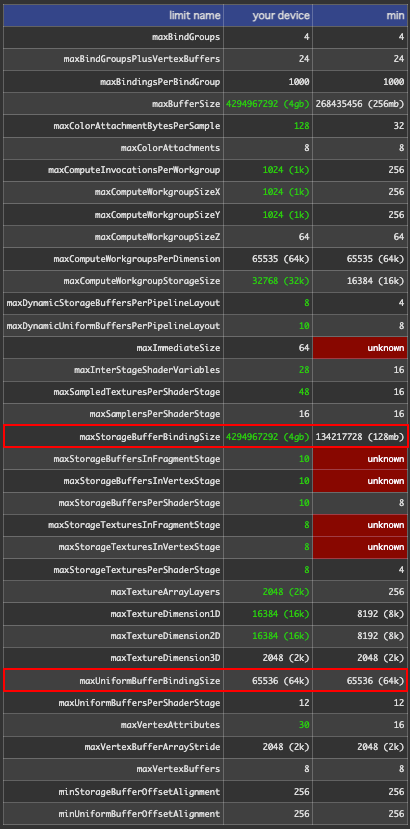
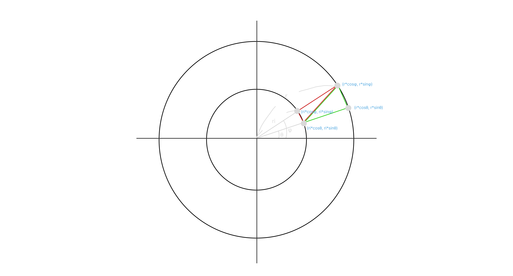

# ストレージバッファ

https://webgpufundamentals.org/webgpu/lessons/ja/webgpu-storage-buffers.html

---

## ユニフォームバッファをストレージバッファに置き換える
宣言と`usage`を差し替えるだけで前章の例がそのまま動く

### WGSL
```diff
- @group(0) @binding(0) var<uniform> ourStruct: OurStruct;
- @group(0) @binding(1) var<uniform> otherStruct: OtherStruct;
+ @group(0) @binding(0) var<storage, read> ourStruct: OurStruct;
+ @group(0) @binding(1) var<storage, read> otherStruct: OtherStruct;
```
### JS
```diff
// OurStruct
const staticUniformBuffer = device.createBuffer({
    label: `static uniforms for obj: ${i}`,
    size: staticUniformBufferSize,
-   usage: GPUBufferUsage.UNIFORM | GPUBufferUsage.COPY_DST,
+   usage: GPUBufferUsage.STORAGE | GPUBufferUsage.COPY_DST,
});

// OtherStruct
const uniformBuffer = device.createBuffer({
    label: `changing uniforms for obj: ${i}`,
    size: uniformBufferSize,
-   usage: GPUBufferUsage.UNIFORM | GPUBufferUsage.COPY_DST,
+   usage: GPUBufferUsage.STORAGE | GPUBufferUsage.COPY_DST,
});
```

---

## ユニフォームバッファとストレージバッファの違い

| 観点 | ユニフォームバッファ | ストレージバッファ |
|---|---|---|
| パフォーマンス | 多種類のオブジェクトを描く一般的な用途では速いことがある | 同一オブジェクトを大量に描く場合に向く |
| サイズ上限 | 64 KiB（65536 バイト） | 128 MiB（134217728 バイト） |
| 読み書き | 読み取り専用 | 読み書き可（コンピュートシェーダーから書き込み可能／[前章の例](https://webgpufundamentals.org/webgpu/lessons/ja/webgpu-fundamentals.html#a-run-computations-on-the-gpu)） |

### サイズ上限はいずれも既定の最小保証値
参考：https://webgpufundamentals.org/webgpu/lessons/ja/webgpu-limits-and-features.html



`adapter`からも確認可能。
```ts
const adapter = await navigator.gpu?.requestAdapter();
console.log(adapter?.limits.maxStorageBufferBindingSize) // 4294967292
console.log(adapter?.limits.maxUniformBufferBindingSize) // 65536
```

### どちらを選ぶかは用途次第
- 大量の異なるオブジェクト：ユニフォームバッファ
    - Ex.） 3Dゲーム（車、建物、岩、茂み、人々のマテリアル）
- 同一オブジェクトの多数インスタンス：ストレージバッファ
    - Ex.） 本章で扱う同一オブジェクト（三角形・トーラス）の描画

---

## ストレージバッファでインスタンス化する

- ユニフォーム版はオブジェクトごとにバッファとバインドグループを用意し、`draw(3)` をループで回していた。
- ストレージバッファを構造体の**配列**にして、全オブジェクト分のデータを1本のバッファに入れると、`draw(3, kNumObjects)` の1回で描ける。
- 各インスタンスは `@builtin(instance_index)` を添字にして、自分のデータを配列から取り出す。WebGL の `gl_InstanceID` を使ったインスタンシングに相当（[参考](https://wgld.org/d/webgl2/w008.html)）。

### 01. 配列の宣言と`instance_index`

宣言をランタイムサイズ配列（`array<T>`）に変え、頂点シェーダーで `instance_index` を受け取る。

```diff
- @group(0) @binding(0) var<storage, read> ourStruct: OurStruct;
- @group(0) @binding(1) var<storage, read> otherStruct: OtherStruct;
+ @group(0) @binding(0) var<storage, read> ourStructs: array<OurStruct>;
+ @group(0) @binding(1) var<storage, read> otherStructs: array<OtherStruct>;
```

```diff
@vertex fn vs(
  @builtin(vertex_index) vertexIndex: u32,
+ @builtin(instance_index) instanceIndex: u32   // インスタンスごとに 0〜kNumObjects-1
) -> VSOutput {
+ let otherStruct = otherStructs[instanceIndex]; // このインスタンスの scale
+ let ourStruct = ourStructs[instanceIndex];     // このインスタンスの color/offset
  ...
```

- `draw` の第2引数がインスタンス数。1インスタンスにつき頂点シェーダーが3回（`vertex_index` = 0,1,2）呼ばれ、それが `instance_index` の数だけ繰り返される。

#### 補足： ランタイムサイズ配列
```wgsl
@group(0) @binding(0) var<storage, read> a: array<OurStruct>;    // ランタイムサイズ（storage のみ）
@group(0) @binding(1) var<uniform>       b: array<OurStruct, 100>; // 固定長（uniform はこちら）
```
- 要素数を書かない `array<T>` が**ランタイムサイズ配列**。長さはバインドしたバッファのサイズから実行時に決まるので、`kNumObjects` を増減しても WGSL 側はコードの変更が必要ない。
    - 使えるのはストレージバッファのみ（ユニフォームバッファの配列は固定長のみ）
    - 構造体の中に置く場合は最後のメンバーでなければならない（「最後のメンバーのみ」という制約から、末尾は1つしかないので、必然的に構造体あたり1つまで）（AI 情報／動作未確認）
        ```wgsl
        struct Good {
            count: u32,
            items: array<Item>,  // OK：末尾なので可
        };

        struct Bad {
            items: array<Item>,  // NG：末尾でないメンバーにランタイムサイズ配列は置けない
            count: u32,
        };
        ```
- 固定長にするなら要素数を明示した `array<T, N>` を使う（`N` はコンパイル時定数）。
    - ユニフォームバッファの配列はこの固定長のみ
        ```wgsl
        @group(0) @binding(1) var<uniform> b: array<OurStruct, 100>;
        ```

- 長さは WGSL の`arrayLength(&arr)`で取得できる。配列へのポインタ（`&`）を渡すと要素数（`u32`）が返る
    - ランタイムサイズ配列専用なので storage のみ。uniform（固定長）では使えない（長さは `N` で自明）

    <u>**使用例**</u>

    コンピュートは `workgroup_size` 単位でしかディスパッチできない。要素数がその倍数でないと、ディスパッチ数の切り上げで invocation が余り、あふれた `id.x` で範囲外アクセスが起きる。`arrayLength` で要素数を取り、はみ出す invocation を弾く
    ```wgsl
    @group(0) @binding(0) var<storage, read_write> data: array<f32>;   // 要素数 100 とする

    // 64個ずつ処理。100 は 64 の倍数でないので dispatchWorkgroups(2) → 128 invocation が走る
    @compute @workgroup_size(64) fn main(@builtin(global_invocation_id) id: vec3u) {
        let i = id.x;
        let n = arrayLength(&data);   // 要素数（= 100）
        if (i >= n) { return; }       // 余った id.x = 100〜127 を弾く
        data[i] = data[i] * 2.0;      // 各要素にアクセス
    }
    ```
    [前章のコンピュートシェーダの例](https://webgpufundamentals.org/webgpu/lessons/ja/webgpu-fundamentals.html#a-run-computations-on-the-gpu)に当てはめて考える。
    ```wgsl
    @group(0) @binding(0) var<storage, read_write> data: array<f32>;

    @compute @workgroup_size(1) fn computeSomething(
        @builtin(global_invocation_id) id: vec3u
    ) {
        let i = id.x;
        let n = arrayLength(&data);   // = 3
        if (i >= n - 1u) { return; } // 最後の要素（i=2）を弾く
        data[i] = data[i] * 2.0;
    }

    // input: [1, 3, 5]
    // result: [2, 6, 5]
    ```

### 02. 色は頂点シェーダーから inter-stage 変数として渡す

- フラグメントシェーダーは `instance_index` を受け取れない（どのインスタンスかはフラグメント段階では意味を持たない）
- 色は頂点シェーダーで配列から取得し、inter-stage 変数として渡す

```diff
+ struct VSOutput {
+  @builtin(position) position: vec4f,
+  @location(0) color: vec4f,   // 頂点シェーダーで配列から取り出した色をフラグメントへ
+ };

@vertex fn vs(
  @builtin(vertex_index) vertexIndex : u32,
  @builtin(instance_index) instanceIndex: u32
+ ) -> VSOutput {
  let pos = array(
    vec2f( 0.0,  0.5),  // top center
    vec2f(-0.5, -0.5),  // bottom left
    vec2f( 0.5, -0.5)   // bottom right
  );

  let otherStruct = otherStructs[instanceIndex];
  let ourStruct = ourStructs[instanceIndex];

+ var vsOut: VSOutput;
+ vsOut.position = vec4f(pos[vertexIndex] * otherStruct.scale + ourStruct.offset, 0.0, 1.0);
+ vsOut.color = ourStruct.color;
+ return vsOut;
}

+ @fragment fn fs(vsOut: VSOutput) -> @location(0) vec4f {
+   return vsOut.color;
}
```

### 03. 1回の描画にまとめる

- `bindGroup`はオブジェクトごとではなく**全体で1個**だけつくる（[前章](https://webgpufundamentals.org/webgpu/lessons/ja/webgpu-uniforms.html)では `for` の中で 100 個つくっていた）。
- 全オブジェクトの scale を1つの配列（`storageValues`）に詰めて一括アップロードし、`draw` を1回だけ呼ぶ。

```diff
- for (const {scale, bindGroup, uniformBuffer, uniformValues} of objectInfos) {
-   uniformValues.set([scale / aspect, scale], kScaleOffset);
-   device.queue.writeBuffer(uniformBuffer, 0, uniformValues);
-   pass.setBindGroup(0, bindGroup);
-   pass.draw(3);
- }
+ objectInfos.forEach(({scale}, ndx) => {
+   const offset = ndx * (changingUnitSize / 4);
+   storageValues.set([scale / aspect, scale], offset + kScaleOffset);
+ });
+ device.queue.writeBuffer(changingStorageBuffer, 0, storageValues); // 全スケールを一括
+ pass.setBindGroup(0, bindGroup);
+ pass.draw(3, kNumObjects);                                         // 描画は1回
```

→ 異なる `scale` / `color` / `offset` を持つ三角形 100 個が、1 回の描画呼び出しで描かれる

---

## 頂点データにストレージバッファを使用する

- これまで頂点はシェーダー内に`array(...)`でハードコードしていた
- ストレージバッファのもう一つの用途が、頂点データの格納
- `instance_index`を添字に構造体配列から要素を取り出したのと同じ要領で、`vertex_index`を添字に頂点配列から要素を取り出す

### 01. `vertex_index`で頂点を取得する

`Vertex`構造体の配列を`binding(2)`に追加し、ハードコードした`pos`を置き換える。


```diff
+ struct Vertex {
+   position: vec2f,
+ };

+ @group(0) @binding(2) var<storage, read> pos: array<Vertex>;

  @vertex fn vs(
    @builtin(vertex_index) vertexIndex: u32,
    @builtin(instance_index) instanceIndex: u32
  ) -> VSOutput {
-   let pos = array(
-     vec2f( 0.0,  0.5),  // top center
-     vec2f(-0.5, -0.5),  // bottom left
-     vec2f( 0.5, -0.5),  // bottom right
-   );
    ...
-   vsOut.position = vec4f(pos[vertexIndex] * otherStruct.scale + ourStruct.offset, 0.0, 1.0);
+   vsOut.position = vec4f(pos[vertexIndex].position * otherStruct.scale + ourStruct.offset, 0.0, 1.0);
```

### 02. 頂点データを作る（円の生成）

#### `createCircleVertices`で円の頂点を生成する
サブディビジョンごとに2三角形、1三角形あたり3頂点、各頂点 xy の2値。
```ts
 // 1つのサブディビジョンあたり2つの三角形、1つの三角形あたり3つの頂点、それぞれ2つの値（xy）。
const numVertices = numSubdivisions * 2 * 3;
const vertexData = new Float32Array(numSubdivisions * 2 * 3 * 2);

let offset = 0;
const addVertex = (x: number, y: number) => {
    vertexData[offset++] = x;
    vertexData[offset++] = y;
};

for (let i = 0; i < numSubdivisions; ++i) {
    const angle1 =
        startAngle + ((i + 0) * (endAngle - startAngle)) / numSubdivisions;
    const angle2 =
        startAngle + ((i + 1) * (endAngle - startAngle)) / numSubdivisions;

    const c1 = Math.cos(angle1);
    const s1 = Math.sin(angle1);
    const c2 = Math.cos(angle2);
    const s2 = Math.sin(angle2);

    // 最初の三角形
    addVertex(c1 * radius, s1 * radius);
    addVertex(c2 * radius, s2 * radius);
    addVertex(c1 * innerRadius, s1 * innerRadius);

    // 2番目の三角形
    addVertex(c1 * innerRadius, s1 * innerRadius);
    addVertex(c2 * radius, s2 * radius);
    addVertex(c2 * innerRadius, s2 * innerRadius);
}
```


#### 頂点用のストレージバッファを作成
```ts
const { vertexData, numVertices } = createCircleVertices({ radius: 0.5, innerRadius: 0.25 });

const vertexStorageBuffer = device.createBuffer({
  label: 'storage buffer vertices',
  size: vertexData.byteLength,
  usage: GPUBufferUsage.STORAGE | GPUBufferUsage.COPY_DST,
});
device.queue.writeBuffer(vertexStorageBuffer, 0, vertexData);
```

生成したバッファを`binding(2)`としてバインドグループに追加する。
```diff
const bindGroup = device.createBindGroup({
    label: 'bind group for objects',
    layout: pipeline.getBindGroupLayout(0),
    entries: [
        { binding: 0, resource: staticStorageBuffer },
        { binding: 1, resource: changingStorageBuffer },
+       { binding: 2, resource: vertexStorageBuffer },
    ],
});
```

描画は、頂点数がハードコードの`3`から、生成した頂点数`numVertices`に変わる。
```diff
- pass.draw(3, kNumObjects);
+ pass.draw(numVertices, kNumObjects);
```

### 03. 構造体にするか vec2f 直接か

- `array<Vertex>` を `array<vec2f>` にして、`pos[vertexIndex]` と直接書くこともできる
- 構造体にしておくと、後で頂点ごとのデータ（法線・UV など）を足しやすい

```diff
- @group(0) @binding(2) var<storage, read> pos: array<Vertex>;
+ @group(0) @binding(2) var<storage, read> pos: array<vec2f>;
...
- pos[vertexIndex].position * otherStruct.scale + ourStruct.offset
+ pos[vertexIndex] * otherStruct.scale + ourStruct.offset
```

#### 法線・UV を足す例

- `vec2f` 直接だと位置しか持てないが、構造体ならメンバーを増やすだけで済む

```diff
  struct Vertex {
    position: vec2f,
+   normal: vec3f,
+   uv: vec2f,
  };
```

```wgsl
struct VSOutput {
  @builtin(position) position: vec4f,
  @location(0) color: vec4f,
  @location(1) normal: vec3f,   // 追加
  @location(2) uv: vec2f,       // 追加
};

@vertex fn vs(...) -> VSOutput {
  let v = pos[vertexIndex];
  var vsOut: VSOutput;
  vsOut.position = vec4f(v.position * otherStruct.scale + ourStruct.offset, 0.0, 1.0);
  vsOut.color = ourStruct.color;
  vsOut.normal = v.normal;
  vsOut.uv = v.uv;
  return vsOut;
}
```

#### メモリレイアウトの設定

- `vec2f` = align 8 / size 8
- `vec3f` = align 16  / size 12
- `vec3f` はアラインメント 16 バイトなので、`vec2f`（8）の直後には置けず、構造体にパディングが入る。
- 各メンバーは自分の align の倍数の位置に置く
- 構造体サイズは構造体 align の倍数に丸める（＝その倍数まで切り上げる）
    - 構造体 align ＝ メンバー最大の align（ここでは `vec3f` の 16）

| メンバー | 型 | align | オフセット(byte) | サイズ(byte) |
|---|---|---|---|---|
| position | vec2f | 8 | 0 | 8 |
| （パディング） | | | 8 | 8 |
| normal | vec3f | 16 | 16 | 12 |
| （パディング） | | | 28 | 4 |
| uv | vec2f | 8 | 32 | 8 |
| （末尾パディング） | | | 40 | 8 |

記事の `addVertex`（`offset++` で1つずつ進める書き方）を、追加メンバーとパディングぶんの `offset` 送りに拡張する。

```diff
- let offset = 0;
- const addVertex = (x, y) => {
-   vertexData[offset++] = x;
-   vertexData[offset++] = y;
- };
+ let offset = 0;
+ const addVertex = (x, y, nx, ny, nz, u, v) => {
+   vertexData[offset++] = x;    // position.x   (byte 0)
+   vertexData[offset++] = y;    // position.y   (byte 4)
+   offset += 2;                 // パディング    (byte 8-15)
+   vertexData[offset++] = nx;   // normal.x     (byte 16)
+   vertexData[offset++] = ny;   // normal.y     (byte 20)
+   vertexData[offset++] = nz;   // normal.z     (byte 24)
+   offset += 1;                 // パディング    (byte 28-31)
+   vertexData[offset++] = u;    // uv.x         (byte 32)
+   vertexData[offset++] = v;    // uv.y         (byte 36)
+   offset += 2;                 // 末尾パディング (byte 40-47)
+ };
```

配列の確保も 1 頂点 2 個から 12 個に変わる。

```diff
- const vertexData = new Float32Array(numSubdivisions * 2 * 3 * 2);
+ const vertexData = new Float32Array(numSubdivisions * 3 * 2 * 12); // 12 = 48 byte / 4
```

### 04. 頂点バッファより速いとは限らない

ストレージバッファ経由で頂点を渡す方法は普及しつつあるが、一部の古いデバイスでは、古典的な頂点バッファより遅い場合がある（頂点バッファは[次章](https://webgpufundamentals.org/webgpu/lessons/ja/webgpu-vertex-buffers.html)）。