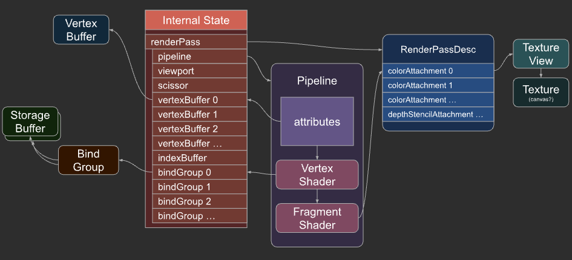
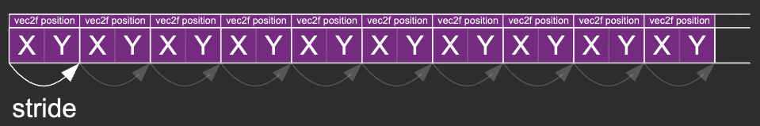
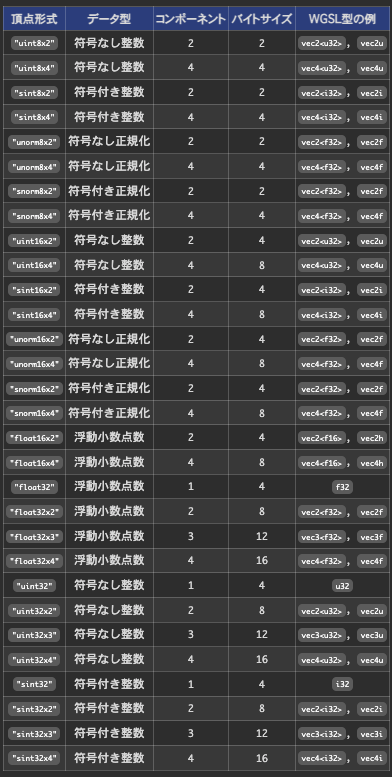
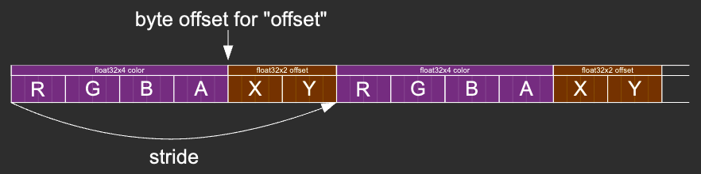
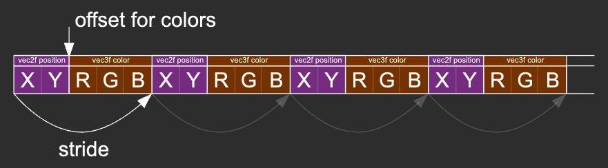
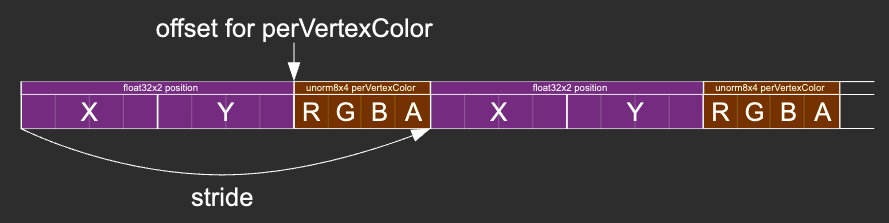

# 頂点バッファ

https://webgpufundamentals.org/webgpu/lessons/ja/webgpu-vertex-buffers.html

---

## 頂点バッファを用いてデータを送る

### 01. ストレージバッファとの違い
- [前章](../04_storage-buffers/README.md)では頂点をストレージバッファに入れ、頂点シェーダーが `@builtin(vertex_index)` を添字にして自分で配列から取り出していた
    ```wgsl
    let v = vertices[vertexIndex];
    vsOut.position = vec4f(v.position * otherStruct.scale + ourStruct.offset, 0.0, 1.0);
    ```
- 頂点バッファは、他の WebGPU バッファと同様に、データを保持する
- それらのバッファとの違いは、頂点シェーダーから直接アクセスしないこと
    
    パイプライン経由で WebGPU にバッファ内のデータの種類と編成方法を伝え、データをバッファから取り出して提供してもらう
    ```diff
    const pipeline = device.createRenderPipeline({
      // ...
      vertex: {
        module: shaderModule,
    +   buffers: [
    +     {
    +      arrayStride: 2 * 4, // 2 floats, 4 bytes each
    +       attributes: [
    +         { shaderLocation: 0, offset: 0, format: 'float32x2' }, // position
    +       ],
    +     },
        ],
      },
      // ...
    });
    ```
### 02. WebGL の VBO ＋ `vertexAttribPointer` に相当する

| WebGL | WebGPU |
|---|---|
| `gl.createBuffer` / `gl.ARRAY_BUFFER` | `createBuffer`（`usage: VERTEX`） |
| `gl.vertexAttribPointer(loc, size, type, normalized, stride, offset)` | パイプラインの `vertexbuffers[x].attributes[]`（`format` が size/type/normalized をまとめる） |
| `gl.getAttribLocation` ⇔ GLSL の `layout(location=)` | `shaderLocation` ⇔ WGSL の `@location(n)` |
| `gl.enableVertexAttribArray` ＋ `bindBuffer` | `pass.setVertexBuffer(slot, buffer)` |

### 03. ストレージバッファから頂点バッファへの移行

#### （ i ） WGSL：`vertex_index` での配列参照をやめ、`@location` で受け取る

```diff
+ struct Vertex {
-   position: vec2f,
+   @location(0) position: vec2f,
+ };

- @group(0) @binding(2) var<storage, read> vert: array<Vertex>;

  @vertex fn vs(
-   @builtin(vertex_index) vertexIndex: u32,
+   vert: Vertex,
    @builtin(instance_index) instanceIndex: u32
  ) -> VSOutput {
    ...
-   vsOut.position = vec4f(vert[vertexIndex].position * otherStruct.scale + ourStruct.offset, 0.0, 1.0);
+   vsOut.position = vec4f(vert.position * otherStruct.scale + ourStruct.offset, 0.0, 1.0);
```

- 頂点データを持っていた `@group(0) @binding(2) var<storage, read> vert` は不要になる。

#### （ ii ） パイプラインで並びを宣言する

- `vertex.buffers` は「頂点バッファ1本＝配列1要素」。1本の中の各属性を `attributes` に並べる。

```ts
const pipeline = device.createRenderPipeline({
  layout: 'auto',
  vertex: {
    module: shaderModule,
    buffers: [
      {
        arrayStride: 2 * 4, // 1頂点分のバイト数（vec2f = 8）。次の頂点まで何バイト進むか
        attributes: [
          { shaderLocation: 0, offset: 0, format: 'float32x2' }, // position → @location(0)
        ],
      },
    ],
  },
  fragment: { module: shaderModule, targets: [{ format: presentationFormat }] },
});
```




| フィールド | 意味 |
|---|---|
| `arrayStride` | 1頂点分のバイト数。次の頂点データまで進む距離 |
| `shaderLocation` | WGSL の `@location(n)` と数値で対応 |
| `offset` | そのバッファ内で属性が始まるバイト位置 |
| `format` | 型と成分数（`float32x2` = 32bit float ×2） |

#### （ iii ） バッファの作成と設定

- 頂点データは `bindGroup` ではなく `setVertexBuffer` で渡す
- `usage` は `STORAGE` から `VERTEX` に変わる。

```diff
const vertexBuffer = device.createBuffer({
  label: 'vertex buffer vertices',
  size: vertexData.byteLength,
- usage: GPUBufferUsage.STORAGE | GPUBufferUsage.COPY_DST,
+ usage: GPUBufferUsage.VERTEX  | GPUBufferUsage.COPY_DST,
});
device.queue.writeBuffer(vertexBuffer, 0, vertexData);

const bindGroup = device.createBindGroup({
  label: 'bind group for objects',
  layout: pipeline.getBindGroupLayout(0),
  entries: [
    { binding: 0, resource: staticStorageBuffer },
    { binding: 1, resource: changingStorageBuffer },
-   { binding: 2, resource: vertexStorageBuffer },
    ],
});
```

```diff
// render 内
pass.setPipeline(pipeline);
+ pass.setVertexBuffer(0, vertexBuffer); // 第1引数は buffers[] の添字
...
pass.setBindGroup(0, bindGroup);
pass.draw(numVertices, numObjects);
```

#### （ iv ） 補足：属性フォーマットは以下のいずれかの型になる


---

## 頂点バッファを使用したインスタンス化

- 前章では `color` / `offset` / `scale` をストレージバッファの構造体配列に入れ、`instance_index` で取得していた
- これらも頂点バッファに移せる
- `stepMode: 'instance'` を付けると、属性が頂点ごとではなくインスタンスごとに進む

| `stepMode` | 属性が進む単位 | 相当する添字 |
|---|---|---|
| `'vertex'`（既定） | 頂点ごと | `vertex_index` |
| `'instance'` | インスタンスごと（同一インスタンス内の全頂点で同じ値） | `instance_index` |

### 01. 頂点バッファを変更頻度で分ける

| バッファ | `stepMode` | データ | 更新頻度 |
|---|---|---|---|
| vertexBuffer | `'vertex'` | position | 全インスタンス共通 |
| staticVertexBuffer | `'instance'` | color / offset | 一度書いたら変えない |
| changingVertexBuffer | `'instance'` | scale | 毎フレーム更新 |

毎フレーム書き換えるデータだけを別バッファに切り出しておくと、更新時に静的データへ触らずに済む。

### 02. WGSL：`instance_index` を削除し、すべて `@location` で受ける

```diff
- struct OurStruct {
-   color: vec4f,
-   offset: vec2f,
- };

- struct OtherStruct {
-   scale: vec2f,
-};

struct Vertex {
    @location(0) position: vec2f,
+   @location(1) color: vec4f,
+   @location(2) offset: vec2f,
+   @location(3) scale: vec2f,
}

@vertex fn vs(
    vert: Vertex,
-   @builtin(instance_index) instanceIndex: u32
) -> VSOutput {
-   let otherStruct = otherStructs[instanceIndex];
-   let ourStruct = ourStructs[instanceIndex];
    var vsOut: VSOutput;
-   vsOut.position = vec4f(vert.position * otherStruct.scale + ourStruct.offset, 0.0, 1.0);
-   vsOut.color = ourStruct.color;
+   vsOut.position = vec4f(vert.position * vert.scale + vert.offset, 0.0, 1.0);
+   vsOut.color = vert.color;
    return vsOut;
}
```

### 03. パイプラインで頂点バッファを3本を宣言する

```diff
buffers: [
  {
    arrayStride: 2 * 4,     // position(vec2f)
    attributes: [
      { shaderLocation: 0, offset: 0, format: 'float32x2' },
    ],
  },
+ {
+   arrayStride: 6 * 4,     // color(vec4f) + offset(vec2f) = 24 bytes
+   stepMode: 'instance',
+   attributes: [
+     { shaderLocation: 1, offset:  0, format: 'float32x4' }, // color
+     { shaderLocation: 2, offset: 16, format: 'float32x2' }, // offset（color 16バイトの後）
+   ],
+ },
+ {
+   arrayStride: 2 * 4,     // scale(vec2f)
+   stepMode: 'instance',
+   attributes: [
+     { shaderLocation: 3, offset: 0, format: 'float32x2' },
+   ],
+ },
],
```



- **頂点属性には、ストレージバッファの構造体と同じパディング制限がない（パディングが不要）**
- `bindGroup` は不要になり、3本を `setVertexBuffer` で渡す
- 描画は前章と同じく `draw(numVertices, numObjects)`

```diff
- pass.setBindGroup(0, bindGroup);
+ pass.setVertexBuffer(0, vertexBuffer);        // position
+ pass.setVertexBuffer(1, staticVertexBuffer);  // color / offset
+ pass.setVertexBuffer(2, changingVertexBuffer);// scale
pass.draw(numVertices, numObjects);
```

---

## 頂点ごとに色をつける

### 01. インスタンス単位の `color` とは別に、頂点ごとの色を持たせる

- 新しいバッファを足さず、`position` と同じ頂点バッファに**インターリーブ**する（1頂点分の中に `position` と `color` を交互に詰める）。

#### （ i ） WGSL
```diff
struct Vertex {
  @location(0) position: vec2f,
  @location(1) color: vec4f,
  @location(2) offset: vec2f,
  @location(3) scale: vec2f,
+ @location(4) perVertexColor: vec3f,
};

...

@vertex fn vs(
  vert: Vertex,
) -> VSOutput {
    ...
-   vsOut.color = vert.color;
+   vsOut.color = vert.color * vec4f(vert.perVertexColor, 1);
    return vsOut;
}
```

#### （ ii ） JS
```diff
{
- arrayStride: 2 * 4,
+ arrayStride: 5 * 4, // position(vec2f) + perVertexColor（vec3f） = 20 bytes
  attributes: [
    { shaderLocation: 0, offset: 0, format: 'float32x2' }, // position
+   { shaderLocation: 4, offset: 8, format: 'float32x3' }, // perVertexColor
  ],
},
```




### 02. 頂点データの生成（`createCircleVertices`）

- 頂点生成は 1頂点あたり 2値（xy）から 5値（xy ＋ rgb）に拡張し、内側を明るく・外側を暗くする。

```diff
// 1つのサブディビジョンあたり2つの三角形、1つの三角形あたり3つの頂点
const numVertices = numSubdivisions * 2 * 3;
- const vertexData = new Float32Array(numVertices * 2); // xy
+ const vertexData = new Float32Array(numVertices * (2 + 3)); // xy + rgb

- const addVertex = (x, y) => {
+ const addVertex = (x, y, r, g, b) => {
    vertexData[offset++] = x;
    vertexData[offset++] = y;
+   vertexData[offset++] = r;
+   vertexData[offset++] = g;
+   vertexData[offset++] = b;
  };

+ const innerColor = [1, 1, 1];
+ const outerColor = [0.1, 0.1, 0.1];

for (let i = 0; i < numSubdivisions; ++i) {
-   addVertex(c1 * radius, s1 * radius);
-   addVertex(c2 * radius, s2 * radius);
-   addVertex(c1 * innerRadius, s1 * innerRadius);
+   addVertex(c1 * radius, s1 * radius, ...outerColor);
+   addVertex(c2 * radius, s2 * radius, ...outerColor);
+   addVertex(c1 * innerRadius, s1 * innerRadius, ...innerColor);
}
```

### 03. WGSL の属性は JavaScript の属性と一致する必要はない

#### （ i ） JS 側（`shaderLocation`）と WGSL 側（`@location(n)`）は番号だけで結び付く

- 構造体にまとめるか個別引数にするかは自由で、宣言順やメンバー名は無関係

```diff
- struct Vertex {
-   @location(0) position: vec2f,
-   @location(1) color: vec4f,
-   @location(2) offset: vec2f,
-   @location(3) scale: vec2f,
-   @location(4) perVertexColor: vec3f,
- }

@vertex fn vs(
-   vert: Vertex,
+   @location(0) position: vec2f,
+   @location(1) color: vec4f,
+   @location(2) offset: vec2f,
+   @location(3) scale: vec2f,
+   @location(4) perVertexColor: vec3f,
) -> VSOutput {
    var vsOut: VSOutput;
-   vsOut.position = vec4f(vert.position * vert.scale + vert.offset, 0.0, 1.0);
-   vsOut.color = vert.color * vec4f(vert.perVertexColor, 1);
+   vsOut.position = vec4f(position * scale + offset, 0.0, 1.0);
+   vsOut.color = color * vec4f(perVertexColor, 1);
    return vsOut;
}
```

#### （ ii ）  属性は WGSL 側で**常に4成分**として読める

- 成分数の少ない `format` を多い型で受け取ると、足りない分は `[0, 0, 0, 1]` の既定値で埋まる
- demo では `format: 'float32x3'`（3成分）を WGSL で `vec4f` として受け、4成分目に既定の `1` が入る

```wgsl
@location(4) perVertexColor: vec4f              // JS の format は float32x3（3成分）だが vec4f として受ける
...
vsOut.color = vert.color * vert.perVertexColor; // 4成分目は既定の 1
```

---

## 正規化された値を使用してスペースを節約する

### 01. `8`ビット値を使用し、`0〜255` から `0.0〜1.0` に正規化する

- 色は 0〜1 の範囲しか使わないのに、`f32` で持つと 1成分 4バイトを消費する
- `unorm8x4` を使うと 1成分 1バイト（`0〜255`）で格納し、GPU が読むときに `0.0〜1.0` へ自動で正規化する
- WebGL の `vertexAttribPointer(..., normalized = true)` に相当する（らしい）
- 色を `unorm8x4` にすると、頂点色（`perVertexColor`）・インスタンス色（`color`）ともに 4バイトに収まる

    | `format` | 消費バイト | WGSL 型 | 値域 |
    |---|---|---|---|
    | `float32x2` | 8 | `vec2f` | そのまま |
    | `float32x3` | 12 | `vec3f` | そのまま |
    | `unorm8x4` | 4 | `vec4f` | 0〜255 → 0.0〜1.0 |

```diff
// 頂点バッファ：position(8) + color(4)
{
- arrayStride: 5 * 4,
+ arrayStride: 2 * 4 + 4,   // 2 floats, 4 bytes each + 4 bytes
  attributes: [
    { shaderLocation: 0, offset: 0, format: 'float32x2' }, // position
-   { shaderLocation: 4, offset: 8, format: 'float32x3' }, // perVertexColor
+   { shaderLocation: 4, offset: 8, format: 'unorm8x4'  }, // perVertexColor
  ],
},
// static インスタンスバッファ：color(4) + offset(8)
{
- arrayStride: 6 * 4,
+ arrayStride: 4 + 2 * 4,   // 4 bytes + 2 floats, 4 bytes each
  stepMode: 'instance',
  attributes: [
-   { shaderLocation: 1, offset:  0, format: 'float32x4' }, // color
-   { shaderLocation: 2, offset: 16, format: 'float32x2' }, // offset
+   { shaderLocation: 1, offset: 0, format: 'unorm8x4'  }, // color
+   { shaderLocation: 2, offset: 4, format: 'float32x2' }, // offset
  ],
},
```

### 02. 1つの ArrayBuffer を2つの TypedArray で書く （`vertexBuffer`）

`unorm8x4`（バイト）と `float32`（4バイト）が同じバッファに混在するので、同一 `ArrayBuffer` を `Uint8Array` と `Float32Array` の両方から見て、バイト位置ごとに使い分けて書く。

```ts
const vertexData = new Float32Array(numVertices * (2 + 1)); // xy(2) + color(1つ分=4バイト)
const colorData  = new Uint8Array(vertexData.buffer);       // 同じ領域を Uint8 で見る

let offset = 0;       // Float32Array 上の添字 （4バイト = 1単位で見る）
let colorOffset = 8;  // Uint8Array 上のバイト位置（position 8バイトの後　/ １バイト = 1単位で見る）
const addVertex = (x, y, r, g, b) => {
  vertexData[offset++] = x;
  vertexData[offset++] = y;
  offset += 1;                    // 色の1つ分（4バイト）はスキップ
  colorData[colorOffset++] = r * 255;
  colorData[colorOffset++] = g * 255;
  colorData[colorOffset++] = b * 255;
  colorOffset += 9;               // 余りの1バイト + 次頂点の position 8バイトをスキップ
};
```



- **削減量**： 8バイト（20 → 12バイト）

### 03. static インスタンスデータ （staticVertexBuffer）
```diff
const staticUnitSize =
-    4 * 4 + // color
+    4 +     // color
     2 * 4;  // offset

const staticVertexBufferSize = staticUnitSize * kNumObjects;

...

const kColorOffset = 0;
- const kOffsetOffset = 4;  // 4 バイト分
+ const kOffsetOffset = 1;  // 1 バイト分

...

-   const staticVertexValues = new Float32Array(staticVertexBufferSize / 4);
+   const staticVertexValuesU8 = new Uint8Array(staticVertexBufferSize);
+   const staticVertexValuesF32 = new Float32Array(staticVertexValuesU8.buffer);

for (let i = 0; i < kNumObjects; ++i) {
-   const staticOffset = i * (staticUnitSize / 4);
+   const staticOffsetU8 = i * staticUnitSize;
+   const staticOffsetF32 = staticOffsetU8 / 4;

    staticVertexValuesU8.set(
-       [rand(), rand(), rand(), 1],
+       [rand() * 255, rand() * 255, rand() * 255, 255],
-       staticOffset + kColorOffset
+       staticOffsetU8 + kColorOffset
    );

    staticVertexValuesF32.set(
       [rand(-0.9, 0.9), rand(-0.9, 0.9)],
-      staticOffset + kOffsetOffset
+      staticOffsetF32 + kOffsetOffset
    );
}

```

- **削減量**： 12バイト（24 → 12バイト）

---

## インデックスバッファ

- これまでは 1サブディビジョンあたり 2三角形 × 3頂点で、同じ座標の頂点を重複して持っていた
- インデックスバッファを使うと、頂点は一度だけ用意し、描画順を添字で参照できる
- WebGL の `gl.ELEMENT_ARRAY_BUFFER` ＋ `drawElements` に相当

### 01. 頂点データの生成（createCircleVertices）

#### （ i ） 頂点は共有できる形で作り直す

- 外周・内周のペアを 1周分だけ作る。頂点数は `numSubdivisions * 2 * 3`（24分割で 144）から `(numSubdivisions + 1) * 2`（同 50）に減る。

```diff
- const numVertices = numSubdivisions * 2 * 3;   // 1つのサブディビジョンあたり2つの三角形、1つの三角形あたり3つの頂点
+ const numVertices = (numSubdivisions + 1) * 2; // 各分割に2頂点 + 一周ぶんの1組

// 0  2  4  6  8 ...  ← 外周
// 1  3  5  7  9 ...  ← 内周
- for (let i = 0; i < numSubdivisions; ++i) {
-   // 三角形2枚ぶん6頂点を毎回追加
+ for (let i = 0; i <= numSubdivisions; ++i) {
+   const angle = startAngle + i * (endAngle - startAngle) / numSubdivisions;
+   addVertex(cos * radius,      sin * radius,      ...outerColor);
+   addVertex(cos * innerRadius, sin * innerRadius, ...innerColor);
  }
```

#### （ ii ） インデックスデータ

- 三角形を頂点の添字で並べる。1サブディビジョンあたり 6インデックス（三角形2枚）。

```ts
const indexData = new Uint32Array(numSubdivisions * 6);
let ndx = 0;
// 1番目の三角形  2番目の三角形
// 0 1 2          2 1 3
//
// 0--2     2     2--4 ...
// | /     /|     | /
// |/     / |     |/
// 1     1--3     3    ...
for (let i = 0; i < numSubdivisions; ++i) {
  const ndxOffset = i * 2;
  // 最初の三角形                    i = 0 | 1
  indexData[ndx++] = ndxOffset;     // 0 | 2
  indexData[ndx++] = ndxOffset + 1; // 1 | 3
  indexData[ndx++] = ndxOffset + 2; // 2 | 4
  // 2番目の三角形
  indexData[ndx++] = ndxOffset + 2; // 2 | 4
  indexData[ndx++] = ndxOffset + 1; // 1 | 3
  indexData[ndx++] = ndxOffset + 3; // 3 | 5
}
return {
    vertexData,
    indexData,
    numVertices: indexData.length,
};
```

### 02. インデックスバッファの生成と描画

- `usage` は `INDEX`。`setIndexBuffer` で型（`'uint32'` / `'uint16'`）を指定
- `draw` を `drawIndexed` に変更

```ts
const { vertexData, indexData, numVertices } = createCircleVertices({
    radius: 0.5,
    innerRadius: 0.25,
});

const indexBuffer = device.createBuffer({
  label: 'index buffer',
  size: indexData.byteLength,
  usage: GPUBufferUsage.INDEX | GPUBufferUsage.COPY_DST,
});
device.queue.writeBuffer(indexBuffer, 0, indexData);
```

```diff
pass.setVertexBuffer(0, vertexBuffer);
pass.setVertexBuffer(1, staticVertexBuffer);
pass.setVertexBuffer(2, changingVertexBuffer);
+ pass.setIndexBuffer(indexBuffer, 'uint32');

- pass.draw(numVertices, numObjects);
+ pass.drawIndexed(numVertices, numObjects); // 第1引数はインデックスデータの要素数（= indexData.length）= 重複を許した場合の頂点数
```

- 頂点データの容量が減り、記事では約 33% 削減
- 前章のストレージバッファの例でも、インデックスバッファを使用可能
    - その場合、渡される `@builtin(vertex_index)` の値は、インデックスバッファのインデックスと一致する
