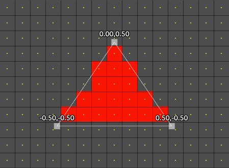

# ストレージテクスチャ

https://webgpufundamentals.org/webgpu/lessons/ja/webgpu-storage-textures.html

---

## ストレージテクスチャとは

シェーダーから好きな場所に直接書き込めるテクスチャ。

### 01. 通常のテクスチャの場合

通常のテクスチャへの描画では、フラグメントシェーダーは書き込む場所を選べない。書けるのは、いま処理しているそのフラグメント自身のピクセルに限られる。



1. 頂点で三角形を渡す
2. GPU（ラスタライザ）が、三角形の覆うピクセルごとにフラグメントシェーダーを実行する
3. 各実行は、自分のピクセル座標を `@builtin(position)`（WebGL の `gl_FragCoord` に相当）で受け取り、そのピクセルの色を返す

書き込み先は、この `@builtin(position)` が指す 1 ピクセルに固定される。
別の座標を指定して書くことはできず、隣や離れたピクセルには手を出せない。対象の１ピクセルがどこになるかも、三角形の形と位置で決まる（シェーダーからは選べない）。

### 02. ストレージテクスチャの場合

ストレージテクスチャには、この「自分のピクセルしか塗れない」という縛りが無い。書き込む座標を自分で指定して、テクスチャの好きな場所へ書ける。

```wgsl
textureStore(tex, vec2u(100, 50), color);   // 座標(100, 50)へこの色、と直接書く
```

- 特別な種類のテクスチャではない
- `createTexture` で作る普通のテクスチャに、使用法フラグ `STORAGE_BINDING` を足すだけで使える

### 03. ストレージバッファとの違いと制限

同じ「好きな場所へ書く」だけなら、ストレージバッファを 2D 配列として使ってもできる。

ストレージバッファなら次のように読み書きするところを、
```wgsl
@group(0) @binding(0) var<storage> buf: array<f32>;

fn loadValueFromBuffer(pos: vec2u) -> f32 {
    return buf[pos.y * width + pos.x];
}
fn storeValueToBuffer(pos: vec2u, v: f32) {
    buf[pos.y * width + pos.x] = v;
}
```

ストレージテクスチャでは `textureLoad` / `textureStore` で行う。

```wgsl
@group(0) @binding(0) var tex: texture_storage_2d<r32float, read_write>;

let pos = vec2u(2, 3);
var v = textureLoad(tex, pos, mipLevel);
textureStore(tex, pos, mipLevel, v * 2.0);
```

一見すると、同じに見える。

#### （ i ） ストレージテクスチャの利点

- **テクスチャのまま扱える**：
    - あるシェーダーではストレージテクスチャとして書き込み、
    - 別のシェーダーでは通常のテクスチャ（サンプラー・ミップマップあり）として読む、という使い分けができる。
- **フォーマット解釈がある**：
    - `rgba8unorm` のストレージテクスチャを `textureLoad` すると、4 バイトが自動で 0〜1 の `vec4f` に変換されて返る。
    - バッファは `array<u32>` から自分でバイトを取り出して浮動小数点へ直す必要がある。
- **次元を持つ**：
    - `textureDimensions(tex)` でサイズを取れる。
    - バッファの次元は長さだけなので、2D 座標を 1D インデックスに直すための `width` を自分で（ユニフォームなどで）渡す必要がある。

#### （ ii ） ストレージテクスチャの制限


- **`read_write` できるフォーマットが限られる**：
    - `r32float` / `r32sint` / `r32uint` のみ。
    - 他の形式は 1 つのシェーダー内では `read` か `write` のどちらか一方のみ。
- **使えるフォーマットが限られる**：
    - `rgba8(unorm/snorm/sint/uint)`, `rgba16(float/sint/uint)`, `rg32(float/sint/uint)`, `rgba32(float/sint/uint)`。
    - `bgra8unorm` が無い点に注意（後述）。
- **サンプラーを使えない**：
    - `textureSample`（ミップ内最大 16 テクセルをブレンド）は不可。
    - `textureLoad` / `textureStore` で 1 テクセルずつ読み書きする。

---

## ストレージテクスチャとしてのキャンバス

### 01. コンテキストに `usage` を設定する

- キャンバスのテクスチャ自体をストレージテクスチャにできる。
- コンテキストの構成でストレージ用途を足す。

```diff
context.configure({
    device,
    format: presentationFormat,
+   usage: GPUTextureUsage.TEXTURE_BINDING | GPUTextureUsage.STORAGE_BINDING,
});
```

- `TEXTURE_BINDING`：ブラウザがキャンバスをページに表示するために必要
- `STORAGE_BINDING`：キャンバスのテクスチャをストレージテクスチャとして書き込むために必要
- レンダーパスでも描きたい場合は `RENDER_ATTACHMENT` も足す
    - `context.configure` の `usage` を省略したときの既定値は `RENDER_ATTACHMENT`
    - 普通にキャンバスへ描くだけなら、これまでは意識しなくても `RENDER_ATTACHMENT` が付いていた

### 02. キャンバスフォーマットと `bgra8unorm-storage`

- 通常は `navigator.gpu.getPreferredCanvasFormat()` で優先フォーマットを取るが、これはシステムに応じて `rgba8unorm` か `bgra8unorm` を返す（多くの場合 `bgra8unorm` が取得される）。
- そして `bgra8unorm` は既定ではストレージテクスチャに使えない。
- `bgra8unorm-storage` という[機能（feature）](https://webgpufundamentals.org/webgpu/lessons/ja/webgpu-limits-and-features.html)を有効にすれば `bgra8unorm` もストレージテクスチャとして使用できる。
- `bgra8unorm-storage` は、優先フォーマットが `bgra8unorm` のプラットフォームなら概ね使えるが、使えない可能性もある。
- そこで機能（feature）の有無を確認し、あれば要求して優先フォーマットを使い、無ければ `rgba8unorm` にフォールバックする。
- `rgba8unorm` はコア機能で必ずストレージに使えるので、フォールバック先として安全。

```diff
const adapter = await navigator.gpu?.requestAdapter();

// 'bgra8unorm-storage' は「形式名」ではなく「機能名」。bgra8unorm をストレージ可にする
+ const hasBGRA8unormStorage =
+   adapter?.features.has('bgra8unorm-storage') ?? false;

const device = await adapter?.requestDevice({
+   requiredFeatures: hasBGRA8unormStorage ? ['bgra8unorm-storage'] : [],
});

// 機能があれば優先フォーマット（多くは bgra8unorm）、無ければ rgba8unorm
+ const presentationFormat = hasBGRA8unormStorage
+   ? navigator.gpu.getPreferredCanvasFormat()
+   : 'rgba8unorm';
```

### 03. 円を描くコンピュートシェーダー

テクスチャに同心円を描くコンピュートシェーダーを作成する

```wgsl
@group(0) @binding(0) var tex: texture_storage_2d<rgba8unorm, write>;

@compute @workgroup_size(1) fn cs(
    @builtin(global_invocation_id) id: vec3u
) {
    let size = textureDimensions(tex);
    let center = vec2f(size) / 2.0;
    let pos = id.xy;
    let dist = distance(vec2f(pos), center);

    let stripe = dist / 32.0 % 2.0;
    let red = vec4f(1, 0, 0, 1);
    let cyan = vec4f(0, 1, 1, 1);
    let color = select(red, cyan, stripe < 1.0);

    textureStore(tex, pos, color);
}
```

- ストレージテクスチャには `write` を付け、シェーダー側に具体的なフォーマットを書く必要がある（`TEXTURE_BINDING` と違い、`STORAGE_BINDING` は正確なフォーマットを知る必要があるため）

- `dist` は中心からの距離（px）
    | dist の範囲 | `dist / 32` | `% 2.0`（stripe） |
    |---|---|---|
    | 0〜32 | 0〜1 | 0〜1 |
    | 32〜64 | 1〜2 | 1〜2 |
    | 64〜96 | 2〜3 | 0〜1 |
    | 96〜128 | 3〜4 | 1〜2 |

    - `dist / 32.0`：32px 刻みの帯番号にする
    - `% 2.0`：2 で割った余り。0〜2 未満を繰り返す（64px 周期）
    - `select(偽の値, 真の値, 条件)`


### 04. パイプラインと描画

パイプラインはコンピュートパイプラインとして組む。

```ts
const pipeline = device.createComputePipeline({
    layout: 'auto',
    compute: { module: shaderModule },
});
```

描画時はキャンバスの現在テクスチャを取り、それをストレージテクスチャとしてバインドし、ワークグループをディスパッチする。

```ts
const texture = context.getCurrentTexture();
const bindGroup = device.createBindGroup({
    layout: pipeline.getBindGroupLayout(0),
    entries: [{ binding: 0, resource: texture }],
});

const pass = encoder.beginComputePass();
pass.setPipeline(pipeline);
pass.setBindGroup(0, bindGroup);
// @workgroup_size(1) なので、ピクセル数ぶんのワークグループを起動する
pass.dispatchWorkgroups(texture.width, texture.height);
pass.end();
```

キャンバスではなく通常のテクスチャでも同じことができる。`getCurrentTexture` の代わりに `createTexture` し、必要な他の使用法フラグとともに `STORAGE_BINDING` を渡せばよい。

---

## 速度とデータ競合

### 01. 速度

上のデモはピクセルごとに 1 ワークグループ（`@workgroup_size(1)`）をディスパッチしている。たとえば 1000×1000 のキャンバスなら、100 万個のワークグループをそれぞれ 1 スレッドで起動することになる。

GPU は複数スレッドをまとめて並列に走らせるハードウェアなので、1 ワークグループ＝1 スレッドだと並列レーンの大半が遊ぶ（無駄）。本来はもっと速い。

最適化するなら、1 ワークグループに複数スレッドを持たせて、ディスパッチ数を減らす。

```wgsl
@compute @workgroup_size(16, 16) fn cs(  // 1 ワークグループ 256 スレッド
    @builtin(global_invocation_id) id: vec3u
) {
    let size = textureDimensions(tex);
    let pos = id.xy;
    if (pos.x >= size.x || pos.y >= size.y) { return; }  // 16 で割り切れない端のはみ出しを捨てる
    // ...以降は同じ
}
```

```ts
// 各ワークグループがレーンを埋めるので、起動数はこれだけで済む
pass.dispatchWorkgroups(
    Math.ceil(width / 16),
    Math.ceil(height / 16),
);
```

`16×16 = 256` にしたのは、GPU が実行をまとめる単位（wave / warp）の幅が 32 か 64 のことが多く、そのどちらでも割り切れる数ならどの GPU でもレーンが埋まりやすいため。`256` は WebGPU の既定上限 `maxComputeInvocationsPerWorkgroup` でもある。

ただし最適化すると例が複雑になるため、デモは分かりやすさを優先して `@workgroup_size(1)` のままにしている。最適化の詳細は[画像ヒストグラムの記事](https://webgpufundamentals.org/webgpu/lessons/ja/webgpu-compute-shaders-histogram.html)にある。

### 02. データ競合

ストレージテクスチャはどのテクセルへでも書けるぶん、競合状態に注意が必要（呼び出しの実行順は保証されないため）。

※ この章のデモは競合しない。各実行が書くのは自分自身の 1 ピクセル（`pos = id.xy`）だけで、2 つの実行が同じテクセルに触れないため。

競合が起きるのは、複数の実行が同じテクセルへ書くとき。たとえば各実行が「自分のピクセルに加えて隣のピクセルにも書く」処理にすると、1 つのテクセルに複数の実行が書き込みうる。どの実行が最後に書くか（＝どの色が残るか）は実行順しだいで、順序が保証されない以上、結果は不定になる。

競合しない設計にするか、`textureBarrier` などで実行に順序をつけるのは自分の責任になる。

**補足：`textureBarrier()` は、コンピュートシェーダーで呼ぶ同期用の組み込み関数。2 つの働きがある。**

- **待ち合わせ**：同じワークグループ内の全スレッドがこの行に到達するまで、誰も先へ進まない。
- **可視化**：バリアより前にストレージテクスチャへ書いた内容を、バリア後に同じワークグループの他スレッドから見えるようにする。

「全員が書き終えてから、次の段でまとめて読む」といった順序づけに使う。ただし効くのは**同じワークグループ内だけ**で、別のワークグループとの間の競合は解決しない。また、全スレッドが必ず通る位置（分岐で割れない場所）で呼ぶ必要がある。

仲間に `workgroupBarrier()`（ワークグループメモリ用）、`storageBarrier()`（ストレージバッファ用）があり、`textureBarrier()` はストレージテクスチャ用。

---

## ストレージバッファで実装してみる

### 01. 色を自分でパック／アンパックする（フォーマット解釈が無い）

ストレージテクスチャ（`rgba8unorm`）なら `textureStore(tex, pos, color)` に `vec4f` を渡すだけで自動で 4 バイトへ変換されるが、ストレージバッファは `array<u32>` なので、色を自分でパックする。

```wgsl
// compute.wgsl（ストレージバッファ版）
let color = select(red, cyan, stripe < 1.0);   // 0〜1 の vec4f

// ストレージバッファにはフォーマット解釈がない。rgba8unorm 相当へ自分でパックする
let rgba = vec4u(color * 255.0);
let packedColor = rgba.r | (rgba.g << 8) | (rgba.b << 16) | (rgba.a << 24);
```

読み出す側（フラグメント）でも、逆に 4 バイトへ分解して 0〜1 へ戻す。

```wgsl
// render.wgsl（バッファ版）
let packedColor = buf[pos.y * uni.size.x + pos.x];
let rgba = vec4u(packedColor & 0xffu, (packedColor >> 8) & 0xffu, (packedColor >> 16) & 0xffu, (packedColor >> 24) & 0xffu);
return vec4f(rgba) / 255.0;
```

- ストレージバッファを `array<vec4f>` にすれば `buf[i] = color;` ／ `return buf[i];` で済み、パック・アンパックは不要。
- ただし 1 ピクセル 16 バイト（`u32` の 4 倍）になる。

<details>
<summary>ビット演算の中身</summary>

`u32` は 32 ビット＝4 バイト。各成分（0〜255＝8 ビット）を、担当するバイトへ置く。

```
ビット:  31 … 24 | 23 … 16 | 15 … 8 |  7 … 0
成分　:     a    |    b    |    g   |    r
```

- `rgba.g << 8` は「g 成分（8 ビット）を 8 ビット左へずらして置く」。
- それを `|`（OR）で重ねる。`0xFF` = `11111111`（8 ビットぜんぶ 1）。

**red = `vec4f(1, 0, 0, 1)` → (r,g,b,a) = (255, 0, 0, 255)**

```
rgba.r        : 00000000 00000000 00000000 11111111   0x000000FF
rgba.g << 8   : 00000000 00000000 00000000 00000000   0x00000000
rgba.b << 16  : 00000000 00000000 00000000 00000000   0x00000000
rgba.a << 24  : 11111111 00000000 00000000 00000000   0xFF000000
------------------------------------------------- OR
packedColor   : 11111111 00000000 00000000 11111111   0xFF0000FF
```

**cyan = `vec4f(0, 1, 1, 1)` → (r,g,b,a) = (0, 255, 255, 255)**

```
rgba.r        : 00000000 00000000 00000000 00000000   0x00000000
rgba.g << 8   : 00000000 00000000 11111111 00000000   0x0000FF00
rgba.b << 16  : 00000000 11111111 00000000 00000000   0x00FF0000
rgba.a << 24  : 11111111 00000000 00000000 00000000   0xFF000000
------------------------------------------------- OR
packedColor   : 11111111 11111111 11111111 00000000   0xFFFFFF00
```

読み出し（unpack）は逆。`>> n` で目的のバイトを最下位へ下ろし、`& 0xFF` で 8 ビットだけ残す。

**パックした cyan（`packedColor = 0xFFFFFF00`）から g を取り出す `(packedColor >> 8) & 0xFF` を追う。**

**Step 1: `>> 8`（g のバイトを最下位へ下ろす）**

```
packedColor  : 11111111 11111111 11111111 00000000   0xFFFFFF00
                 a=FF     b=FF     g=FF     r=00
>> 8         : 00000000 11111111 11111111 11111111   0x00FFFFFF
                          a=FF     b=FF     g=FF     ← g が最下位に来た
```

`u32` なので上位は 0 で埋まる。最下位が g になったが、上に b・a のゴミ（どちらも FF）が残る。

**Step 2: `& 0xFF`（ = `& 0x000000FF` ）（最下位 8 ビットだけ残す）**

```
0x00FFFFFF   : 00000000 11111111 11111111 11111111
& 0x000000FF : 00000000 00000000 00000000 11111111
------------------------------------------------- AND
結果         : 00000000 00000000 00000000 11111111   0xFF = 255 = g
```

`0xFF` は下位 8 ビットが全部 1、上位 24 ビットが 0 のマスク。AND すると、**マスクが 1 の側（下位 8 ビット）は元のまま、マスクが 0 の側（上位 24 ビット）は 0** になる。結果、g のバイトはそのまま残り、上のゴミ（b・a）は消える。最後に `/ 255.0` で g = 1.0 に戻る。

</details>

<details>
<summary>シフトの 0 埋め / 1 埋め</summary>

- **左シフト `<<`**：常に**下位を 0 で埋める**（型・符号に関係なく）。上からあふれたビットは捨てる。
- **右シフト `>>`**：左オペランドの型で埋め方が変わる。

  | 型・符号 | 上位ビットの埋め方 |
  |---|---|
  | `u32`（符号なし） | 0（論理シフト） |
  | `i32` で正の値 | 0（符号ビット = 0） |
  | `i32` で負の値 | 1（符号ビット = 1。算術シフト） |

  ※ 埋めるのは固定の 1 ではなく「符号ビット」。負数のときだけ 1 になる。

このデモの `packedColor` と `rgba` は `u32` なので、`>>` は必ず 0 埋め。だから `& 0xFF` でマスクすれば上位のゴミが残らず、バイトをきれいに取り出せる。

（WGSL は `>>` の論理／算術を型で自動選択する。JS の `>>`（符号伝播）と `>>>`（0 埋め）のような演算子の使い分けは無い。）

</details>

### 02. 幅を渡してインデックスを自分で計算する

ストレージテクスチャは `textureDimensions(tex)` で幅・高さを取れるが、ストレージバッファは 1 次元（長さ）しか持たず、幅・高さの情報が無い。そこで幅・高さをユニフォームで渡し、2D 座標を 1D インデックスに変換する。

```wgsl
struct Uni { size: vec2u };
@group(0) @binding(1) var<uniform> uni: Uni;

buf[pos.y * uni.size.x + pos.x] = packedColor;   // 幅で 2D → 1D
```

### 03. 表示のために追加のレンダーパスが必要

ストレージバッファはそのままでは画面に出せない。コンピュートシェーダでストレージバッファを埋めたあと、画面全体を覆う板ポリを描くレンダーパスで、フラグメントごとにストレージバッファを読み出してキャンバスへ描く。

```ts
// コンピュート：円をストレージバッファへ書き込む
computePass.dispatchWorkgroups(width, height);
// レンダー：バッファを読んで全画面の板ポリに貼り出す
renderPass.draw(4);
```

ストレージバッファ版はキャンバスへ普通のレンダーパスで描くだけなので、ストレージテクスチャのように `STORAGE_BINDING` も `bgra8unorm-storage` 機能も必要ない。

| | ストレージテクスチャ版 | ストレージバッファ版 |
|---|---|---|
| フォーマット変換 | `rgba8unorm` が自動変換 | 自分でパック / アンパック |
| サイズ取得 | `textureDimensions` | 幅をユニフォームで渡す |
| 表示 | キャンバスへ直接書いて完了 | 追加のレンダーパスで読み出して描く |
| キャンバス設定 | `STORAGE_BINDING`（＋ `bgra8unorm-storage`）が必要 | 通常の描画設定だけ |


