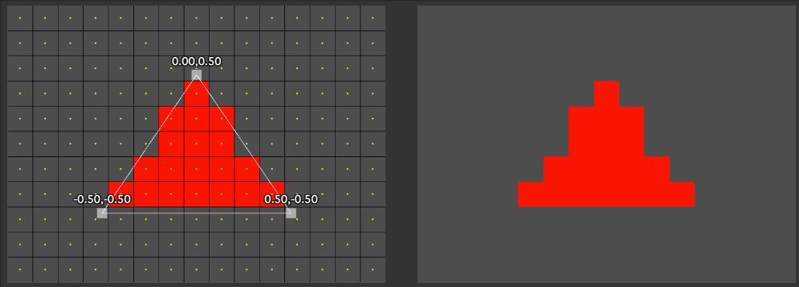
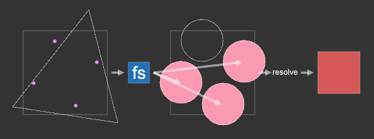
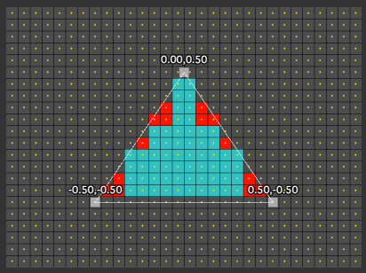
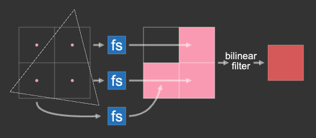
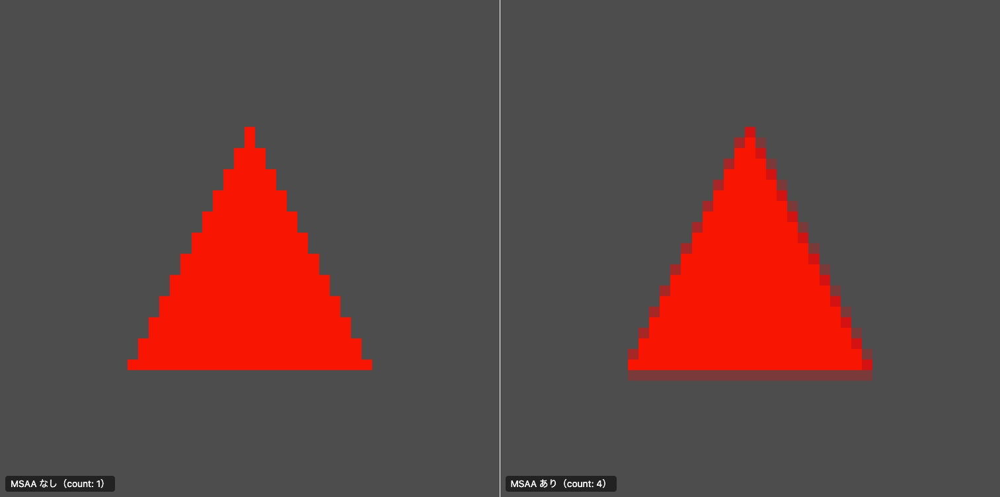
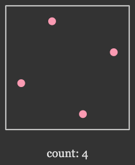
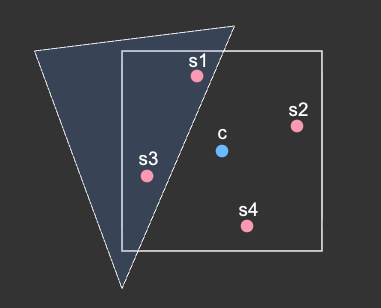
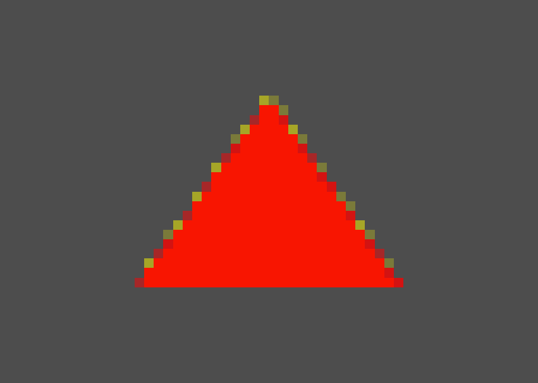
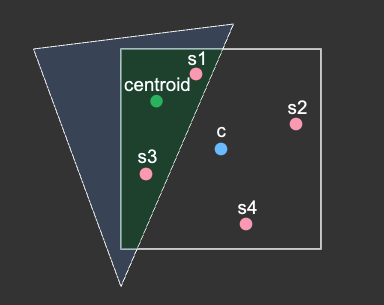
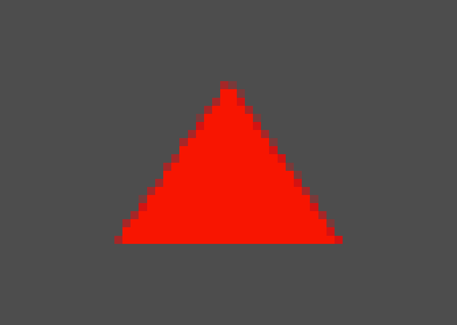

# マルチサンプリング

https://webgpufundamentals.org/webgpu/lessons/ja/webgpu-multisampling.html

---

## マルチサンプリングとは

GPU は「ピクセルの中心が三角形に入っているか」で塗る／塗らないを決める。中心が入っていればそのピクセル全体を塗り、外れていれば塗らない、の二択なので、斜めのエッジはギザギザになる（**エイリアシング**）。



**マルチサンプリング**は、1ピクセルの中に判定用のサンプル点を複数（ここでは4つ）持たせる仕組み。「中心1点」ではなく「4点のうち何点が三角形に覆われたか」を見られるようになる。



この仕組みをアンチエイリアシングに使うのが **MSAA（マルチサンプルアンチエイリアシング）**。覆われたサンプルの割合に応じてエッジのピクセルが中間色になり、境界がなめらかに見える。

### 01. エイリアシングと MSAA の考え方

#### （ i ） 高解像度で描いて縮小する方法との対比

素朴な解決策は、より高い解像度（幅・高さとも2倍＝4倍）で描いてからキャンバスへ縮小する方法。ただし三角形の内部まで含めてフラグメントシェーダを4倍走らせるため重い。




ここでの「縮小」は、高解像度テクスチャをキャンバス（半分のサイズ）へ描くときの縮小サンプリングであり、`minFilter: 'linear'`（バイリニアフィルタリング）が効く。

| | フラグメントシェーダ | 目的 |
| --- | --- | --- |
| 高解像度で描いて縮小 | 4倍のピクセルぶん実行 | 全面を高精細に |
| MSAA | ピクセルにつき1回 | エッジの境界だけなめらかに |

#### （ ii ） MSAA の流れと効率性


1. MSAA は 4 サンプルそれぞれが三角形の内側かを判定し、フラグメントシェーダは内側のサンプルにのみ書き込む
2. そのピクセルが何サンプル覆われていても、フラグメントシェーダは 1 ピクセルにつき 1 回しか走らない
    - `@interpolate(..., sample)` を指定したときだけサンプルごとにフラグメントシェーダが実行される
3. 最後に 1 ピクセル内の 4 サンプルを 1 つの値にまとめて最終的なテクスチャ（キャンバス）へ書き出す（resolve）
4. 解決（resolve）するプロセスはバイリニアフィルタリングではなく、GPU 次第

---

## 使い方

### 01. パイプラインを設定する

```ts
const pipeline = device.createRenderPipeline({
  layout: 'auto',
  vertex: { module },
  fragment: { module, targets: [{ format: presentationFormat }] },
  multisample: { count: 4 }, // このパイプラインはマルチサンプルテクスチャへ描く
});
```

### 02. マルチサンプルテクスチャを作る

キャンバスと同じフォーマット・同じサイズで、`sampleCount` を付けたテクスチャを作る。キャンバスのサイズが変わったら作り直す。

```ts
if (!multisampleTexture ||
    multisampleTexture.width !== canvasTexture.width ||
    multisampleTexture.height !== canvasTexture.height) {

    // 古いものは破棄
    multisampleTexture?.destroy();

    multisampleTexture = device.createTexture({
      format: canvasTexture.format,                       // キャンバスと同じフォーマット
      usage: GPUTextureUsage.RENDER_ATTACHMENT,
      size: [canvasTexture.width, canvasTexture.height],  // キャンバスと同じサイズ
      sampleCount: 4,                                     // マルチサンプルであることの指定
    });
}
```

### 03. レンダーパスで解決する

描画先（`view`）をマルチサンプルテクスチャにし、`resolveTarget` にキャンバスを渡す。パス終了時にマルチサンプルの結果がキャンバスへ縮小される。

```ts
colorAttachment.view = multisampleTexture.createView();     // 描画先 ＝ マルチサンプルテクスチャ
colorAttachment.resolveTarget = canvasTexture.createView(); // 解決先 ＝ キャンバス
```

### 04. MSAA あり／なしを見比べる

フル解像度だと1ピクセルが小さく差が見えにくいので、描画バッファ（`canvas.width/height`）をわざと小さくして CSS で拡大表示すると、1ピクセルが大きく見えて差がはっきり出る。

このとき `image-rendering: pixelated` を指定すると、引き伸ばし時にブラウザの補間（バイリニア）が入らず、各ピクセルの色がそのまま見える。

| | パイプライン | 描画先 |
| --- | --- | --- |
| MSAA なし | `multisample: { count: 1 }` | キャンバスへ直接（`resolveTarget` なし） |
| MSAA あり | `multisample: { count: 4 }` | マルチサンプルテクスチャ → `resolveTarget` で解決 |



---

## 注意点

### 01. `count` は `4`（バージョン 1 は `1` か `4` のみ）

WebGPU バージョン 1 では `count` に指定できるのは `1`（マルチサンプルなし＝デフォルト）か `4` のみ。

### 02. サンプル位置はグリッドではない


- 1 ピクセル内の 4 サンプルは格子状ではなく不規則に配置される
- この配置はほとんどの状況でより良いアンチエイリアシングをもたらす




### 03. `resolveTarget` はすべてのレンダーパスで設定しなくてよい

- 複数パスで描くときは、途中のパスでは resolve せず、最後のパスでのみ `resolveTarget` を指定するのが好ましい
  - resolve だけを行う空のパスを最後に足す手もある
- その場合、最初のパス以外のすべてのパスで `loadOp` を `'clear'` ではなく `'load'` に設定する必要がある

**例: 同じマルチサンプルテクスチャに2パスで描き、最後だけ resolve する**
```ts
// 初期化時
const pass1Desc = {
  colorAttachments: [{
    view: undefined,
    loadOp: 'clear',
    storeOp: 'store'
  }],
};
const pass2Desc = {
  colorAttachments: [{
    view: undefined,
    resolveTarget: undefined,
    loadOp: 'load',   // clear だとパス1の描画が消える
    storeOp: 'store',
  }],
};
```

```ts
// render（毎フレーム）
const canvasTexture = context.getCurrentTexture();

pass1Desc.colorAttachments[0].view = multisampleTexture.createView();

pass2Desc.colorAttachments[0].view = multisampleTexture.createView();
pass2Desc.colorAttachments[0].resolveTarget = canvasTexture.createView(); // 最後のパスだけ resolve

const pass1 = encoder.beginRenderPass(pass1Desc);
// ... 描画 ...
pass1.end();

const pass2 = encoder.beginRenderPass(pass2Desc);
// ... 描画 ...
pass2.end();
```

resolve だけを行う空のパスを最後に足す方法もある（その空パスで `resolveTarget` を指定する）。

---

## サンプルごとにフラグメントシェーダを実行する

### 01. `@interpolate（..., center / centroid / sample）`

inter-stage 変数の補間位置を `@interpolate` で選べる。

| 指定 | 補間の基準位置 | シェーダ実行 |
| --- | --- | --- |
| `center`（デフォルト） | ピクセル中心 | ピクセルにつき1回 |
| `centroid` | 三角形とピクセルの重なり領域内 | ピクセルにつき1回 |
| `sample` | 各サンプル位置 | サンプルごと |

**`@interpolate（..., sample）`**
- `@builtin(sample_index)` のような組み込みがあり、現在作業しているサンプルを教えてくれる
- `@builtin(sample_mask)` は、入力として、三角形の内側にあるサンプルを教えてくれ、出力として、サンプルポイントが更新されるのを防ぐことができる

### 02. center の問題

MSAA では 4 サンプルのどれかが覆われればそのピクセルは描画されるが、補間はピクセル中心で行われる。そのため、エッジのピクセルでは「一部のサンプルは三角形内だが、ピクセル中心は三角形の外」ということが起こる（MSAA なしなら中心が外のピクセルは描画されないので、この問題は起きない）。

補間の基準がピクセル中心（`center`）だと、この中心で補間された値は三角形の範囲を外れ、重心座標による内外判定などが破綻する。



**WGSL**

```wgsl
struct VOut {
    @builtin(position) position: vec4f,
    @location(0) baryCoord: vec3f,
};

@vertex fn vs(
    @builtin(vertex_index) vertexIndex: u32
) -> VOut {
    let pos = array(
        vec2f( 0.0,  0.5),  // top center
        vec2f(-0.5, -0.5),  // bottom left
        vec2f( 0.5, -0.5),  // bottom right
    );
    let bary = array(
        vec3f(1, 0, 0),
        vec3f(0, 1, 0),
        vec3f(0, 0, 1),
    );
    var vout: VOut;
    vout.position = vec4f(pos[vertexIndex], 0.0, 1.0);
    vout.baryCoord = bary[vertexIndex];
    return vout;
}

@fragment fn fs(vin: VOut) -> @location(0) vec4f {
    let allAbove0 = all(vin.baryCoord >= vec3f(0));
    let allBelow1 = all(vin.baryCoord <= vec3f(1));
    let inside = allAbove0 && allBelow1; // 三角形の内部か
    let red = vec4f(1, 0, 0, 1);
    let yellow = vec4f(1, 1, 0, 1);
    return select(yellow, red, inside);  // 内部なら赤色・外部なら黄色
}
```

**結果： 0 ~ 1 の値を補間した際、本来 １ を超えるはずがないが、ピクセル中心で補間された値は三角形の範囲を外れ １ を超えることがある**



### 03. centroid で解決する

`centroid` にすると、補間の基準がピクセルと三角形の重なり領域内に収まる。補間値は必ず三角形内の値になり、内外判定が破綻しない。



**WGSL**

```wgsl
@location(0) @interpolate(perspective, centroid) baryCoord: vec3f
```

**結果**



---

## 三角形内部のアンチエイリアシング

**MSAA はエッジにしか効かない**

- 三角形の内側では4サンプルすべてが三角形に覆われ、同じ色が全サンプルに書かれるため MSAA の効果はない
- MSAA が改善するのはエッジの境界のみ
- テクスチャ内部のジャギー（縮小時のちらつき）はミップマップとフィルタリングで対処する