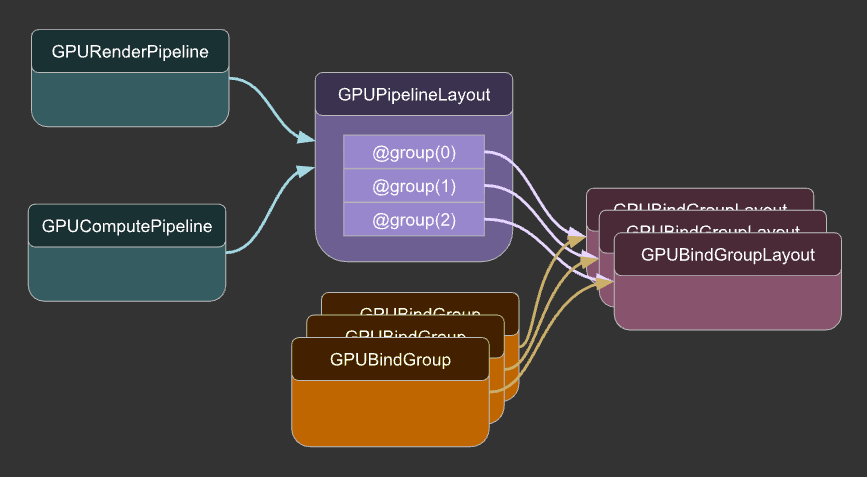
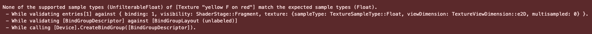

# バインドグループレイアウト

https://webgpufundamentals.org/webgpu/lessons/ja/webgpu-bind-group-layouts.html

---

- これまでの章では `layout: 'auto'` に任せてバインドグループを作ってきた。
- この章では、その裏で作られている「レイアウト」を自分で書く。

## 仕組み：パイプラインレイアウトとバインドグループレイアウト

### 01. `GPUPipelineLayout` と `GPUBindGroupLayout` の関係

- パイプライン（`GPURenderPipeline` / `GPUComputePipeline`）は 1 つの `GPUPipelineLayout` を持ち、そこにグループインデックスごとの `GPUBindGroupLayout` が並ぶ。
- バインドグループもそれぞれ特定の `GPUBindGroupLayout` から作られる。



- `draw` / `dispatchWorkgroups` の実行時、WebGPU は「現在のパイプラインの各グループの `GPUBindGroupLayout` が、`setBindGroup` でバインドしたバインドグループと一致するか」をチェックするだけで済む。
- 詳細なチェックのほとんどは、バインドグループを作成するときに行われる。

```ts
// 詳細なチェックのほとんどは、バインドグループを作成するときに行われる
const bindGroup = device.createBindGroup({
  layout: pipeline.getBindGroupLayout(0), // グループ0のレイアウトに紐付く
  entries: [{ binding: 0, resource: { buffer } }],
});

// render
pass.setPipeline(pipeline);
pass.setBindGroup(0, bindGroup);
// 実行時は、現在のパイプラインの各グループの GPUBindGroupLayout が、
// setBindGroup でバインドしたバインドグループと一致するかをチェックするだけ
pass.draw(3);
```

### 02. `layout: 'auto'` を指定した場合

- `layout: 'auto'` はパイプライン作成時に、シェーダーのコードから `GPUPipelineLayout` と `GPUBindGroupLayout` を推測して自動生成する指定。
- 生成されたレイアウトは `pipeline.getBindGroupLayout(N)` で取り出せる。
- [バインドグループレイアウトを自動的に生成する際のルール](https://www.w3.org/TR/webgpu/#abstract-opdef-default-pipeline-layout)

### 03. `layout: 'auto'` を使用しない理由は主に2つ

1. **`layout: 'auto'` と異なるレイアウトが必要**
    - シェーダーのコードからは推測できない構成を指定したいとき（[rgba32float](#例1rgba32float) ／ [動的オフセット](#例2動的オフセット)）
2. **1つ以上のパイプラインでバインドグループを使用したい**
    - `layout: 'auto'` で作ったレイアウト由来のバインドグループは、別のパイプラインでは使えない（[複数パイプラインでバインドグループを使う](#例3複数パイプラインでバインドグループを使う)）

## 例1：rgba32float

このデモは理由1（`layout: 'auto'` と異なるレイアウトが必要）に当たる。`rgba32float` テクスチャを表示しようとすると `layout: 'auto'` では検証エラーになる。



### 01. 何が問題か

- `rgba32float` はデフォルトではフィルタリングできないフォーマット。
- 一方 `layout: 'auto'` は、シェーダーの `texture_2d<f32>` から「フィルタリング可能なテクスチャ（`sampleType: 'float'`）」を要求するレイアウトを自動生成する。
- 両者が食い違うため、`createBindGroup` の時点で検証エラーになる。

```ts
const texture = device.createTexture({
  label: 'yellow F on red',
  size: [kTextureWidth, kTextureHeight],
  format: 'rgba32float', // rgba32float はデフォルトではフィルタリング不可のフォーマット
  usage: GPUTextureUsage.TEXTURE_BINDING | GPUTextureUsage.COPY_DST,
});

device.queue.writeTexture(
  { texture },
  textureData,
  { bytesPerRow: kTextureWidth * 4 * 4 },
  { width: kTextureWidth, height: kTextureHeight },
);

const sampler = device.createSampler();

device.pushErrorScope('validation'); // 検証エラーの捕捉を開始

const bindGroup = device.createBindGroup({
  layout: pipeline.getBindGroupLayout(0), // フィルタリング可能なテクスチャを要求するレイアウト
  entries: [
    { binding: 0, resource: sampler },
    { binding: 1, resource: texture },
  ],
});

const error = await device.popErrorScope(); // スコープを閉じ、エラーを受け取る
```

**`layout: 'auto'`が生成するバインドグループレイアウト:**
```ts
const bindGroupLayoutDescriptors = [
  {
    entries: [
      {
        binding: 0,
        visibility: GPUShaderStage.FRAGMENT,
        sampler: {
          // 'non-filtering' サンプラーに変更する必要がある
          type: "filtering",
        },
      },
      {
        binding: 1,
        visibility: GPUShaderStage.FRAGMENT,
        texture: {
          // 'rgba8unorm' のタイプであり、 'rgba32float' のタイプではない。
          // 'unfilterable-float' に変更する必要がある
          sampleType: "float",
          viewDimension: "2d",
          multisampled: false,
        },
      },
    ],
  },
];
```

### 02. 明示的なレイアウトで解決する

`createBindGroupLayout` でレイアウトを自分で作り、「フィルタリングしない」ことを宣言する。

#### （ i ） `sampler` を `non-filtering` ／ `texture` を `unfilterable-float` にする

```ts
const bindGroupLayout = device.createBindGroupLayout({
  entries: [
    {
      binding: 0,
      visibility: GPUShaderStage.FRAGMENT,
      sampler: { type: 'non-filtering' },   // フィルタリングしないサンプラー
    },
    {
      binding: 1,
      visibility: GPUShaderStage.FRAGMENT,
      texture: {
        sampleType: 'unfilterable-float',   // フィルタリング不可の float テクスチャ
        viewDimension: '2d',
        multisampled: false,
      },
    },
  ],
});
```

> [!IMPORTANT]
> サンプラー側も揃える必要がある。デフォルトの `createSampler()` は `nearest` のみを使うので `non-filtering` と整合する。`magFilter` / `minFilter` / `mipmapFilter` のいずれかを `'linear'` にすると、`non-filtering` バインディングに `filtering` サンプラーを使ったとしてエラーになる。
> ```ts
> // エラー
> const sampler = device.createSampler({
>   magFilter: 'linear'
> });
> ```


#### （ ii ） `GPUPipelineLayout` を渡してパイプラインを作る

作ったバインドグループレイアウトを `createPipelineLayout` でまとめ、`layout: 'auto'` の代わりにパイプラインへ渡す。

```ts
const pipelineLayout = device.createPipelineLayout({
  bindGroupLayouts: [
    bindGroupLayout   // グループ 0
  ],
});

const pipeline = device.createRenderPipeline({
  label: 'hardcoded textured quad pipeline',
  layout: pipelineLayout,   // 'auto' ではなくレイアウトを明示する
  vertex: { module },
  fragment: {
    module,
    targets: [{ format: presentationFormat }],
  },
});
```

明示レイアウトで作ったパイプラインでも `pipeline.getBindGroupLayout(0)` は使える（自分が渡したレイアウトが返る）。

---

## 例2：動的オフセット

このデモも理由1（`layout: 'auto'` と異なるレイアウトが必要）に当たる。バインドグループ作成時に固定されるバッファのオフセットを、`setBindGroup` の呼び出し時に変えられるようにする。

### 01. 動的オフセットとは

- 通常はバインドグループを作る時点でバッファのオフセットが固定される。
- 動的オフセットを使うと、`setBindGroup` でオフセットを差し替えられる。

**このデモでやりたいこと:**

1 本のバッファに複数のデータ区間を詰めておき、`a` / `b` / `dst` の 3 つのバインディングが「そのバッファのどの区間を見るか（ = オフセット ）」を実行時に指定する。

シェーダーでは `a` / `b` / `dst` の 3 つのストレージバッファバインディングを宣言する。この時点では「3 本のバッファ」に見えるが、後で 3 つとも同じ 1 本のバッファに、異なるオフセットで割り当てる。

```wgsl
@group(0) @binding(0) var<storage, read_write> a: array<f32>;
@group(0) @binding(1) var<storage, read_write> b: array<f32>;
@group(0) @binding(2) var<storage, read_write> dst: array<f32>;

@compute @workgroup_size(1) fn computeSomething(
  @builtin(global_invocation_id) id: vec3u
) {
  let i = id.x;
  dst[i] = a[i] + b[i];
}
```

### 02. hasDynamicOffset: true で宣言する

動的オフセットを使う entry に `hasDynamicOffset: true` を付ける。

```ts
// バインドグループレイアウト
const bindGroupLayout = device.createBindGroupLayout({
  entries: [
    {
      binding: 0,
      visibility: GPUShaderStage.COMPUTE,
      buffer: {
        type: 'storage',
        hasDynamicOffset: true,
      },
    },
    {
      binding: 1,
      visibility: GPUShaderStage.COMPUTE,
      buffer: {
        type: 'storage',
        hasDynamicOffset: true,
      },
    },
    {
      binding: 2,
      visibility: GPUShaderStage.COMPUTE,
      buffer: {
        type: 'storage',
        hasDynamicOffset: true,
      },
    },
  ],
});

// パイプラインレイアウト
const pipelineLayout = device.createPipelineLayout({
  bindGroupLayouts: [ bindGroupLayout ],
});
```

バインドグループ側は `size` を明示する。省くとバッファ全体がサイズになり、オフセット > 0 を指定した時点で範囲外になってエラーになる。

```
動的オフセット + size ≦ バッファ全体のサイズ

オフセット 0   → 0   + 256 = 256  ≦ 768  （区間 a）
オフセット 256 → 256 + 256 = 512  ≦ 768  （区間 b）
オフセット 512 → 512 + 256 = 768  ≦ 768  （区間 dst）
```

```ts
const bindGroup = device.createBindGroup({
  layout: pipeline.getBindGroupLayout(0),
  entries: [
    { binding: 0, resource: { buffer: workBuffer, size: 256 } },
    { binding: 1, resource: { buffer: workBuffer, size: 256 } },
    { binding: 2, resource: { buffer: workBuffer, size: 256 } },
  ],
});
```

### 03. setBindGroup にオフセット配列を渡す

`hasDynamicOffset: true` にした entry の数だけ、バインディング順にオフセットを渡す。

```ts
pass.setPipeline(pipeline);
pass.setBindGroup(0, bindGroup, [0, 256, 512]); // a=0, b=256, dst=512
pass.dispatchWorkgroups(3);
```

バッファは `64 * 3` 個の f32 で確保し、オフセットが 0 / 256 / 512 になるようにしている。f32 は 4 バイトなので、64 個ごと（256 バイトごと）に区間が切り替わる。

```ts
// f32 を 64 * 3 個 = 768 バイト。64 個ごと（256 バイト）に a / b / dst の区間になる
const input = new Float32Array(64 * 3);
input.set([1, 3, 5]);        // a: オフセット 0（先頭）に書く
input.set([11, 12, 13], 64); // b: 64 個目 = オフセット 256 に書く
// dst 区間（128 個目 = オフセット 512）は計算結果の書き込み先

const workBuffer = device.createBuffer({
  label: 'work buffer',
  size: input.byteLength,
  usage: GPUBufferUsage.STORAGE | GPUBufferUsage.COPY_SRC | GPUBufferUsage.COPY_DST,
});
device.queue.writeBuffer(workBuffer, 0, input);
```

> [!WARNING]
> 動的オフセットを使用すると、非動的オフセットよりもわずかに遅くなることに注意する。その理由は、非動的オフセットでは、オフセットとサイズがバッファの範囲内にあるかどうかは、バインドグループを作成するときにチェックされるため。動的オフセットでは、そのチェックは`setBindGroup`を呼び出すまで行えない。`setBindGroup`を数百回しか呼び出さなければ多くの場合その差は問題にならないが、数千回呼び出す場合は、より顕著になる可能性がある。

---

## 例3：複数パイプラインでバインドグループを使う

このデモは理由2（1つ以上のパイプラインでバインドグループを使いたい）に当たる。同じバインドグループを複数のパイプラインで使い回す。

### 01. `layout: 'auto'` では共有できない理由

`layout: 'auto'` で生成されたレイアウトはそのパイプライン固有。そこから作ったバインドグループを別のパイプラインで使うことはできない。共有するには、共通の `GPUBindGroupLayout` を自分で作る。

> [!TIP]
> 3D シーンでは、バインディングを更新頻度で分けるのが一般的。
> - グローバル（射影行列・ビュー行列など）
> - マテリアル（テクスチャ・色）
> - ローカル（モデル行列など）
>
> シャドウを描くときはシーンを 2 回（通常パスとシャドウマップパス）描く。このとき、パスごとに別のバインドグループを用意するより、上の 1 セット（グローバル／マテリアル／ローカル）をそのまま両方のパイプラインで使い回す方が簡単。共有レイアウトにしておくとこれができる。

### 02. 共有レイアウトを作って複数パイプラインで使う

共有する `bindGroupLayout` → `pipelineLayout` を作り、その `pipelineLayout` で複数のパイプラインを作る。ここでは「2 倍にする」「3 を足す」の 2 本を、同じ 1 本のバッファに対して順に適用する。

```ts
const bindGroupLayout = device.createBindGroupLayout({
  entries: [
    {
      binding: 0,
      visibility: GPUShaderStage.COMPUTE,
      buffer: {
        type: 'storage',
        minBindingSize: 0,
      },
    },
  ],
});

const pipelineLayout = device.createPipelineLayout({
  bindGroupLayouts: [bindGroupLayout],
});

const pipelineTimes2 = device.createComputePipeline({
  label: 'doubling compute pipeline',
  layout: pipelineLayout,
  compute: { module: moduleTimes2 }, // data[i] = data[i] * 2.0
});

const pipelinePlus3 = device.createComputePipeline({
  label: 'plus 3 compute pipeline',
  layout: pipelineLayout,
  compute: { module: modulePlus3 },  // data[i] = data[i] + 3.0
});
```

バインドグループは `pipeline.getBindGroupLayout(0)` ではなく、作った `bindGroupLayout` を直接指定する。

```ts
const bindGroup = device.createBindGroup({
  layout: bindGroupLayout,    // 共有レイアウトを直接使う
  entries: [{ binding: 0, resource: workBuffer }],
});
```

実行時は同じ `bindGroup` のまま、パイプラインだけ切り替える。

```ts
pass.setPipeline(pipelineTimes2);
pass.setBindGroup(0, bindGroup);
pass.dispatchWorkgroups(input.length);
pass.setPipeline(pipelinePlus3);    // bindGroup はそのまま使い回す
pass.dispatchWorkgroups(input.length);
```

---

## バインドグループレイアウトの注意点（entries の各プロパティ）

### 01. 共通プロパティ（binding / visibility）

各 entry は最低限この 2 つを宣言する。

| プロパティ | 役割 |
| --- | --- |
| `binding` | シェーダーの `@binding(N)` に対応 |
| `visibility` | どのシェーダーステージから見えるか。`GPUShaderStage.VERTEX \| FRAGMENT \| COMPUTE` をビット OR で合成する |

```ts
visibility: GPUShaderStage.FRAGMENT | GPUShaderStage.VERTEX
```

### 02. リソース別プロパティ

entry には `buffer` / `sampler` / `texture` / `storageTexture` / `externalTexture` のいずれか 1 つを書く。よく使う `sampler` / `texture` はデフォルトがあるので、標準的な使い方なら空オブジェクトで済む。

```ts
entries: [
  { binding: 0, visibility: GPUShaderStage.FRAGMENT, sampler: {} }, // 既定 = filtering
  { binding: 1, visibility: GPUShaderStage.FRAGMENT, texture: {} }, // 既定 = float / 2d
]
```

#### （ i ） `buffer`（`type` / `hasDynamicOffset` / `minBindingSize）`

- `type`
  - `'uniform'`
  - `'storage'`
  - `'read-only-storage'`
- `hasDynamicOffset`
  - `setBindGroup` で動的オフセットを渡すなら `true`
- `minBindingSize`
  - そのバインディングに必要な最小バイト数
  - 指定するとバッファサイズの妥当性を `createBindGroup` 時に検証できる
  - 詳細は [03](#03-minbindingsize-と検証タイミングパフォーマンス)

#### （ ii ） `sampler`（`type`）

- `type`
  - 既定は `'filtering'`
  - フィルタリングしない場合は `'non-filtering'`（`rgba32float` のケース）
  - 比較サンプラーは `'comparison'`（主にシャドウマッピングの深度比較に使う）

#### （ iii ） `texture`（`sampleType` / `viewDimension` / `multisampled`）

既定は次のとおり。

```ts
{ sampleType: 'float', viewDimension: '2d', multisampled: false }
```

`rgba32float` のように直接フィルタリングできないフォーマットでは `sampleType: 'unfilterable-float'` にする。

#### （ iv ） `storageTexture` / `externalTexture`

- `storageTexture`
  - `textureStore` で書き込むテクスチャ
  - `access` / `format` / `viewDimension` を指定する
  - 詳細は [10_storage-textures](../10_storage-textures/README.md)
- `externalTexture`
  - ビデオ由来の外部テクスチャ
  - 詳細は [08_textures-external-video](../08_textures-external-video/README.md)

### 03. `minBindingSize` と検証タイミング（パフォーマンス）

`buffer` の `minBindingSize` は、そのバインディングに必要な最小バイト数。

```wgsl
struct OurStruct {
  color: vec4f,
  scale: vec2f,
  offset: vec2f,
};
@group(0) @binding(0) var<uniform> ourStruct: OurStruct;
```

```ts
buffer: { type: 'uniform', minBindingSize: 32 } // 構造体は 32 バイト
```

- `minBindingSize`を宣言すると、`createBindGroup`を呼び出すときに WebGPU がバッファサイズ／オフセットが正しいサイズであるかどうかをチェックできる。
- `minBindingSize`を設定しない場合、WebGPU は、バッファがパイプラインの正しいサイズであるかどうかを、描画/ディスパッチワークグループ時にチェックする必要がある。
- すべての描画呼び出しをチェックするよりも、バインドグループを作成するときに一度チェックする方が高速。
