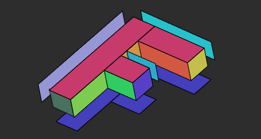
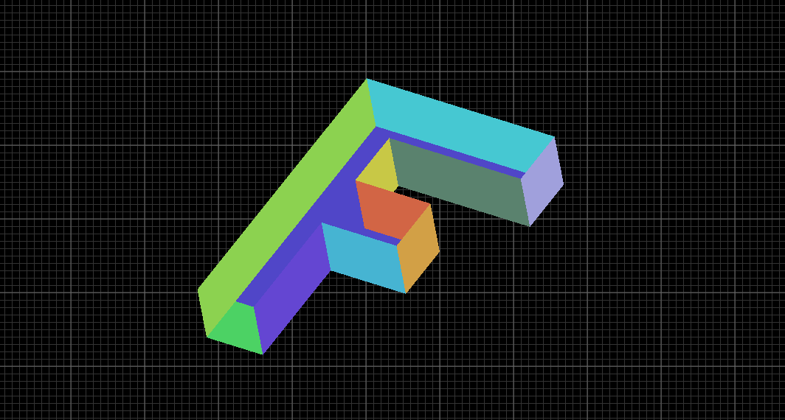
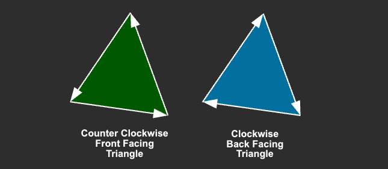
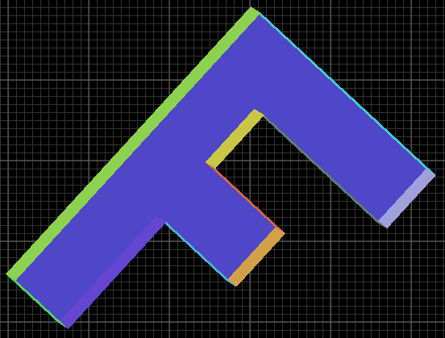
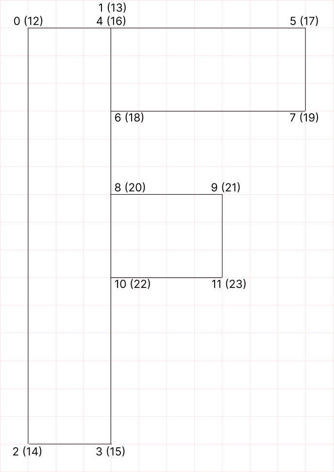
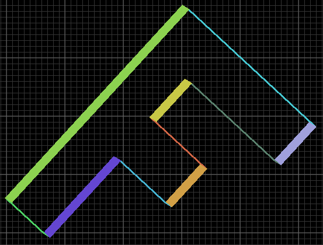
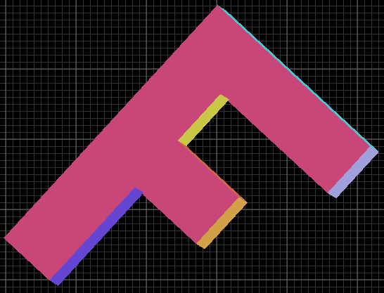
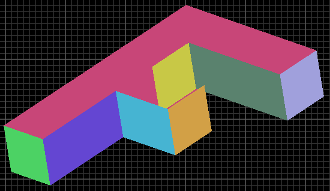
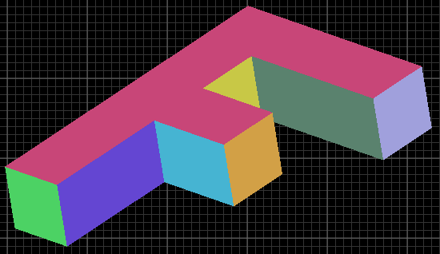
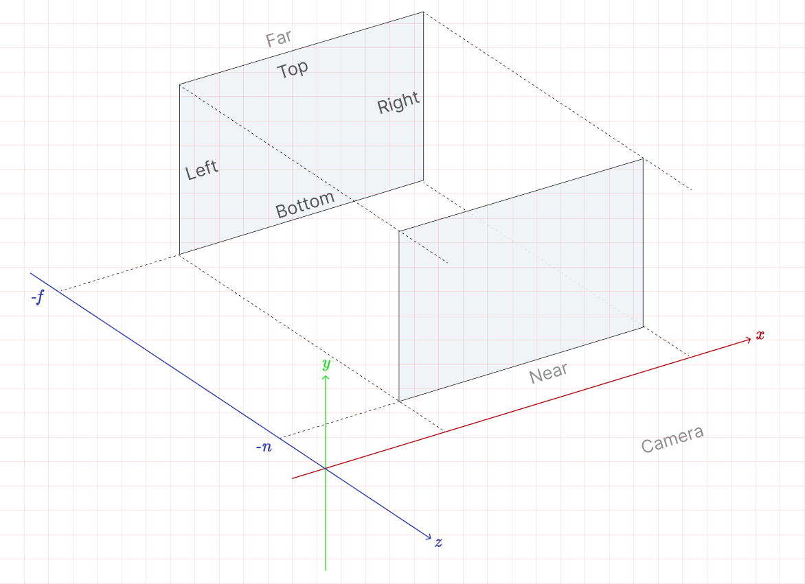

# 正射影

https://webgpufundamentals.org/webgpu/lessons/ja/webgpu-orthographic-projection.html

---

## ３次元に拡張する

### 01. 平行移動

```math
\mathbf{T} =
\begin{bmatrix}
1 & 0 & 0 & t_x \\
0 & 1 & 0 & t_y \\
0 & 0 & 1 & t_z \\
0 & 0 & 0 & 1
\end{bmatrix}
```

```ts
translation([tx, ty, tz]) {
  return [
    1,  0,  0,  0,
    0,  1,  0,  0,
    0,  0,  1,  0,
    tx, ty, tz, 1,
  ];
}
```

### 02. 回転

#### （ i ） X軸回転

```math
\mathbf{R_x} =
\begin{bmatrix}
1 & 0 & 0 & 0 \\
0 & c & -s & 0 \\
0 & s & c & 0 \\
0 & 0 & 0 & 1
\end{bmatrix}
```

```ts
rotationX(rad) {
  const c = Math.cos(rad), s = Math.sin(rad);
  return [
    1, 0,  0, 0,
    0, c,  s, 0,
    0, -s, c, 0,
    0, 0,  0, 1,
  ];
}
```

#### （ ii ） Y軸回転

```math
\mathbf{R_y} =
\begin{bmatrix}
c & 0 & s & 0 \\
0 & 1 & 0 & 0 \\
-s & 0 & c & 0 \\
0 & 0 & 0 & 1
\end{bmatrix}
```

```ts
rotationY(rad) {
  const c = Math.cos(rad), s = Math.sin(rad);
  return [
    c, 0, -s, 0,
    0, 1, 0,  0,
    s, 0, c,  0,
    0, 0, 0,  1,
  ];
}
```

#### （ iii ） Z軸回転

```math
\mathbf{R_z} =
\begin{bmatrix}
c & -s & 0 & 0 \\
s & c & 0 & 0 \\
0 & 0 & 1 & 0 \\
0 & 0 & 0 & 1
\end{bmatrix}
```

```ts
rotationZ(rad) {
  const c = Math.cos(rad), s = Math.sin(rad);
  return [
    c,  s, 0, 0,
    -s, c, 0, 0,
    0,  0, 1, 0,
    0,  0, 0, 1,
  ];
}
```

### 03. スケール

```math
\mathbf{S} =
\begin{bmatrix}
s_x & 0 & 0 & 0 \\
0 & s_y & 0 & 0 \\
0 & 0 & s_z & 0 \\
0 & 0 & 0 & 1
\end{bmatrix}
```

```ts
scaling([sx, sy, sz]) {
  return [
    sx, 0,  0,  0,
    0,  sy, 0,  0,
    0,  0,  sz, 0,
    0,  0,  0,  1,
  ];
}
```

### 04. 射影行列

#### （ i ） ２次元

```wgsl
let zeroToOne        = position / uni.resolution;        // 0 ~ 1
let zeroToTwo        = zeroToOne * 2.0;                  // 0 ~ 2
let flippedClipSpace = zeroToTwo - 1.0;                  // -1 ~ 1
let clipSpace        = flippedClipSpace * vec2f(1, -1);  // Y を反転
```

```math
\mathbf{M} = \mathbf{S_f}\mathbf{T}\mathbf{S_c}\mathbf{S_r}
```

```math
\mathbf{P_{clip}} = \mathbf{M}\mathbf{P_{pixel}}
```

```math
\mathbf{M} =
\begin{bmatrix}
\dfrac{2}{width} & 0 & -1 \\
0 & -\dfrac{2}{height} & 1 \\
0 & 0 & 1
\end{bmatrix}
```

#### （ ii ） ３次元

| 軸 | 入力の範囲 | 出力（クリップ空間） |
| --- | --- | --- |
| X | `0 ~ width` | `-1 ~ 1` |
| Y | `0 ~ height`（+Y：下） | `1 ~ -1`（+Y：上） |
| Z | `-depth ~ +depth` | `0 ~ 1` |

```wgsl
let zeroToOne = position / uni.resolution;      // x,y: 0 ~ 1     z: -1 ~ 1
let scaled    = zeroToOne * vec3f(2, 2, 0.5);   // x,y: 0 ~ 2     z: -0.5 ~ 0.5
let shifted   = scaled + vec3f(-1, -1, 0.5);    // x,y: -1 ~ 1    z: 0 ~ 1
let clipSpace = shifted * vec3f(1, -1, 1);      // Y を反転
```

```math
\mathbf{M} = \mathbf{S_f}\mathbf{T}\mathbf{S_c}\mathbf{S_r}
```

```math
\mathbf{P_{clip}} = \mathbf{M}\mathbf{P_{pixel}}
```


```math
\mathbf{M} =
\begin{bmatrix}
1 & 0 & 0 & 0 \\
0 & -1 & 0 & 0 \\
0 & 0 & 1 & 0 \\
0 & 0 & 0 & 1
\end{bmatrix}
\begin{bmatrix}
1 & 0 & 0 & -1 \\
0 & 1 & 0 & -1 \\
0 & 0 & 1 & 0.5 \\
0 & 0 & 0 & 1
\end{bmatrix}
\begin{bmatrix}
2 & 0 & 0 & 0 \\
0 & 2 & 0 & 0 \\
0 & 0 & 0.5 & 0 \\
0 & 0 & 0 & 1
\end{bmatrix}
\begin{bmatrix}
\frac{1}{width} & 0 & 0 & 0 \\
0 & \frac{1}{height} & 0 & 0 \\
0 & 0 & \frac{1}{depth} & 0 \\
0 & 0 & 0 & 1
\end{bmatrix}
```

```math
=
\begin{bmatrix}
1 & 0 & 0 & 0 \\
0 & -1 & 0 & 0 \\
0 & 0 & 1 & 0 \\
0 & 0 & 0 & 1
\end{bmatrix}
\begin{bmatrix}
1 & 0 & 0 & -1 \\
0 & 1 & 0 & -1 \\
0 & 0 & 1 & 0.5 \\
0 & 0 & 0 & 1
\end{bmatrix}
\begin{bmatrix}
\frac{2}{width} & 0 & 0 & 0 \\
0 & \frac{2}{height} & 0 & 0 \\
0 & 0 & \frac{0.5}{depth} & 0 \\
0 & 0 & 0 & 1
\end{bmatrix}
```

```math
=
\begin{bmatrix}
1 & 0 & 0 & 0 \\
0 & -1 & 0 & 0 \\
0 & 0 & 1 & 0 \\
0 & 0 & 0 & 1
\end{bmatrix}
\begin{bmatrix}
\frac{2}{width} & 0 & 0 & -1 \\
0 & \frac{2}{height} & 0 & -1 \\
0 & 0 & \frac{0.5}{depth} & 0.5 \\
0 & 0 & 0 & 1
\end{bmatrix}
```

```math
=
\begin{bmatrix}
\frac{2}{width} & 0 & 0 & -1 \\
0 & -\frac{2}{height} & 0 & 1 \\
0 & 0 & \frac{0.5}{depth} & 0.5 \\
0 & 0 & 0 & 1
\end{bmatrix}
```

```ts
projection(width, height, depth) {
  return [
    2 / width, 0,           0,           0,
    0,         -2 / height, 0,           0,
    0,         0,           0.5 / depth, 0,
    -1,        1,           0.5,         1,
  ];
}
```

---

## 描画順の問題

- GPU は三角形を渡された順にラスタライズし、生成したフラグメント（ピクセル）をカラーバッファに書き込む。
- 深度テストが無ければ、同じピクセルに後から来たフラグメントが前のものを上書きする（＝後に描いた三角形が上に来る）。
- 頂点の Z 座標を見て、三角形の前後を自動で並べ替えたりはしない。

**考え方**：シールを貼るのと同じで、後から貼ったものが必ず上に来る

### 理想：左 ／ 現実：右

背面にあるはずの青色で前面が塗られてしまっている。




---

## 頂点のたどり順とカリング

- WebGPU（WebGL）の三角形には表・裏がある。
- 判定はクリップ空間での頂点のたどり順（winding order）で決まる。
- どちら回りを表面にするかは、`pipeline.primitive.frontFace`で指定する。既定は`'ccw'`で反時計回りが表面。

| | たどり順 |
| --- | --- |
| 表面（front） | 反時計回り（Counter-Clockwise） |
| 裏面（back） | 時計回り（Clockwise） |


```ts
const pipeline = device.createRenderPipeline({
  // ...
  primitive: {
    cullMode: 'back',   // 'back'=裏面を描かない / 'front'=表面を描かない / 'none'=カリングなし（既定）
    // frontFace: 'ccw',
  },
});
```




---

## 深度テクスチャ（深度バッファ／Z バッファ）

- 各ピクセルの一番手前の Z 値を覚えておき、新しいフラグメントの Z 値と比べて手前だけを残す。
  - Z の場合、クリップ空間は 0 ~ 1 の値を取る（WebGL では -1 ~ 1）
  - 後ろにある（より高いZ値を持つ）ピクセルを後から描画しようとすると、描画されない
- 描画順に関係なく前後関係を正しくできる。

| | WebGL | WebGPU |
| --- | --- | --- |
| 有効化 | `gl.enable(gl.DEPTH_TEST)` | パイプラインの `depthStencil` |
| 比較関数 | `gl.depthFunc(gl.LESS)` | `depthCompare: 'less'` |
| バッファ | コンテキストが暗黙に用意 | 深度テクスチャを自分で作りアタッチ |
| クリア | `gl.clear(gl.DEPTH_BUFFER_BIT)` | `depthLoadOp: 'clear'` ＋ `depthClearValue` |

**`pipeline`に深度の設定を追加する**

```ts
const pipeline = device.createRenderPipeline({
  // ...
  depthStencil: {
    depthWriteEnabled: true,
    depthCompare: 'less',     // 新しい Z がより小さければ（手前なら）描く
    format: 'depth24plus',
  },
});
```

**`renderPassDescriptor`に深度アタッチメントを追加する**
```ts
const depthStencilAttachment = {
  view: undefined,       // レンダー時に設定
  depthClearValue: 1.0,  // 一番奥
  depthLoadOp: 'clear',
  depthStoreOp: 'store',
};
```

**深度テクスチャを作成する**

```ts
if (!depthTexture ||
    depthTexture.width !== canvasTexture.width ||
    depthTexture.height !== canvasTexture.height) {
  depthTexture?.destroy();
  depthTexture = device.createTexture({
    size: [canvasTexture.width, canvasTexture.height],
    format: 'depth24plus',
    usage: GPUTextureUsage.RENDER_ATTACHMENT,
  });
}
depthStencilAttachment.view = depthTexture.createView();
```

---

## 例： 3D の「F」を正しく描画する

### demo 1： たどり順が前面・背面で同じ & カリングなし

頂点のたどり順を「時計回り」とする。この場合、「F」を正面から見ると「裏面」が見えている。  
あとから書いた背面の三角形（青）が、前面の三角形（赤）を上書きしてしまっている。



**3D「F」の頂点配置**



### demo 2： たどり順が前面・背面で同じ & 裏面（back）をカリング

裏面（back）をカリングして背面（青）を消すことを考える。  
ところが前面・背面ともに、こちらへ向いているのは裏面（back）なので、背面と一緒に前面まで消えてしまう。



### demo 3： たどり順が前面・背面で反転 & 表面（front）をカリング

背面側（青）のインデックスを入れ替え、たどり順を反転し（反時計回りにし）、表面（front）がこちらに向くようにする。  
そのうえで表面（front）をカリングすると、表面（front）がこちらに向いている背面は消え、裏面（back）がこちらに向いている前面だけが残る。

※ 描画順を考えれば、背面（青）が手前に来るが、表面（front）をカリングしているため、前面（赤）のフラグメントが上書きされず表示される。

```ts
// 背面や側面のインデックスを反転 = 「反時計回り」 とする
12, 14, 13,  14, 15, 13,  // 元々： 12,13,14, 14,13,15

// パイプライン
primitive: { cullMode: 'front' },
```



ところが、依然として描画順の問題が残り、正しく描画されない部分がある。



### demo 4： 深度値を考慮する



たどり順とカリングを考慮しても、描画順の問題は残り、一部が破綻する。  
そこで深度テクスチャを追加することで、「F」がすべての角度で正しい前後関係になる（描画順に依らない）。

### 深度テクスチャがあればカリングは不要か

見た目の正しさだけなら、閉じた立体（例えば、本章で扱う「F」）では深度テストだけで足りる。  
しかし、カリングを使用することで、パフォーマンスの向上が期待できる。

最終的に隠れて見えないのに、深度テストだけに任せると、GPU はその見えない面についても「フラグメントシェーダーを実行してZ値を計算し、深度テストして、負けたら捨てる」という作業を行う。  
カリングを使えば、その面が不要と分かった時点でシェーダーを実行する前に捨てられ、無駄な計算を省くことができる。

例えば、上記例の場合、「F」の背面（青）は、表面（front）がこちらを向いている。
カリングをしない場合、背面（青）と前面（赤）の深度テストが行われる（結果として前面の赤が表示される）。
しかし、立体が閉じていて、背面の表面が描画されないことがわかっているのであれば、深度テストを行う必要はなく、最初から背面（表面）をカリングしておけばいい。

---

## 正射影（Ortho／Orthographic）



※ ここでは Camera はまだ考えていないため視点は決まっていない（カメラは17章で扱う）

| 軸 | 入力の範囲 | 出力（クリップ空間） |
| --- | --- | --- |
| X | `left ~ right` | `-1 ~ 1` |
| Y | `bottom ~ top` | `-1 ~ 1` |
| Z | `near` ~ `far` | `0 ~ 1` |

原点始まりではないので、まず原点へ寄せてから正規化・拡大・シフトする。

```wgsl
let toOrigin  = position + vec3f(-left, -bottom, near);              // 左下・near 面を原点へ  xy: 0~幅   z: 0~(near-far)
let zeroToOne = toOrigin / vec3f(right-left, top-bottom, near-far); // 0~1
let scaled    = zeroToOne * vec3f(2, 2, 1);                         // xy: 0~2   z: 0~1
let clipSpace = scaled + vec3f(-1, -1, 0);                          // xy: -1~1  z: 0~1
```


```math
\mathbf{M} = \mathbf{T_c}\,\mathbf{S_c}\,\mathbf{S_r}\,\mathbf{T_o}
```

```math
\mathbf{P_{clip}} = \mathbf{M}\,\mathbf{P}
```


```math
\mathbf{M} =
\begin{bmatrix}
1 & 0 & 0 & -1 \\
0 & 1 & 0 & -1 \\
0 & 0 & 1 & 0 \\
0 & 0 & 0 & 1
\end{bmatrix}
\begin{bmatrix}
2 & 0 & 0 & 0 \\
0 & 2 & 0 & 0 \\
0 & 0 & 1 & 0 \\
0 & 0 & 0 & 1
\end{bmatrix}
\begin{bmatrix}
\frac{1}{r-l} & 0 & 0 & 0 \\
0 & \frac{1}{t-b} & 0 & 0 \\
0 & 0 & \frac{1}{n-f} & 0 \\
0 & 0 & 0 & 1
\end{bmatrix}
\begin{bmatrix}
1 & 0 & 0 & -l \\
0 & 1 & 0 & -b \\
0 & 0 & 1 & n \\
0 & 0 & 0 & 1
\end{bmatrix}
```


```math
=
\begin{bmatrix}
1 & 0 & 0 & -1 \\
0 & 1 & 0 & -1 \\
0 & 0 & 1 & 0 \\
0 & 0 & 0 & 1
\end{bmatrix}
\begin{bmatrix}
2 & 0 & 0 & 0 \\
0 & 2 & 0 & 0 \\
0 & 0 & 1 & 0 \\
0 & 0 & 0 & 1
\end{bmatrix}
\begin{bmatrix}
\frac{1}{r-l} & 0 & 0 & \frac{-l}{r-l} \\
0 & \frac{1}{t-b} & 0 & \frac{-b}{t-b} \\
0 & 0 & \frac{1}{n-f} & \frac{n}{n-f} \\
0 & 0 & 0 & 1
\end{bmatrix}
```


```math
=
\begin{bmatrix}
1 & 0 & 0 & -1 \\
0 & 1 & 0 & -1 \\
0 & 0 & 1 & 0 \\
0 & 0 & 0 & 1
\end{bmatrix}
\begin{bmatrix}
\frac{2}{r-l} & 0 & 0 & \frac{-2l}{r-l} \\
0 & \frac{2}{t-b} & 0 & \frac{-2b}{t-b} \\
0 & 0 & \frac{1}{n-f} & \frac{n}{n-f} \\
0 & 0 & 0 & 1
\end{bmatrix}
```

```math
=
\begin{bmatrix}
\frac{2}{r-l} & 0 & 0 & \frac{r+l}{l-r} \\
0 & \frac{2}{t-b} & 0 & \frac{t+b}{b-t} \\
0 & 0 & \frac{1}{n-f} & \frac{n}{n-f} \\
0 & 0 & 0 & 1
\end{bmatrix}
```

```ts
ortho(left, right, bottom, top, near, far) {
  return [
    2 / (right - left),              0,                               0,                   0,
    0,                               2 / (top - bottom),              0,                   0,
    0,                               0,                               1 / (near - far),    0,
    (right + left) / (left - right), (top + bottom) / (bottom - top), near / (near - far), 1,
  ];
}
```


**デモで扱っていた射影関数**

```ts
mat4.projection(
  this.canvas.clientWidth,  // width
  this.canvas.clientHeight, // height
  400,                      // depth
  this.matrixValue,
);
```

**上記変換を正射影関数で行う場合**

```ts
mat4.ortho(
  0,                    // left
  canvas.clientWidth,   // right
  canvas.clientHeight,  // bottom
  0,                    // top
  200,                  // near
  -200,                 // far
  matrixValue,
);
```
