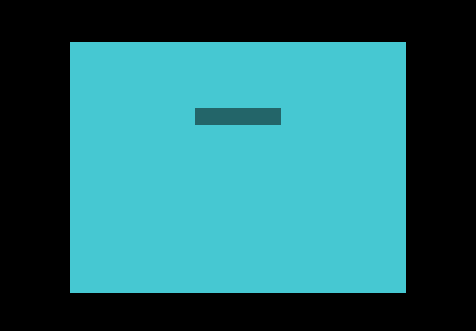
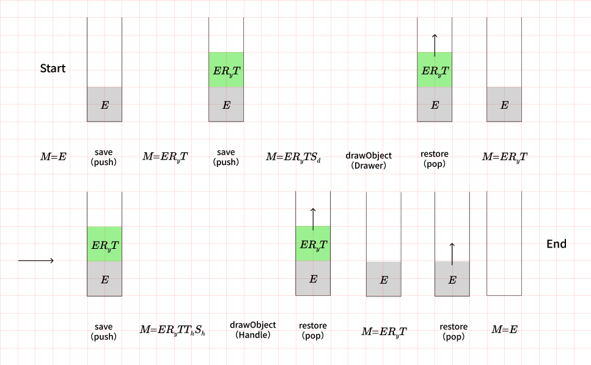
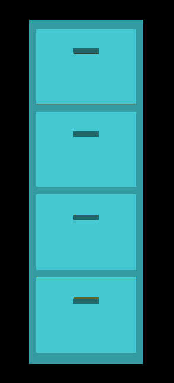
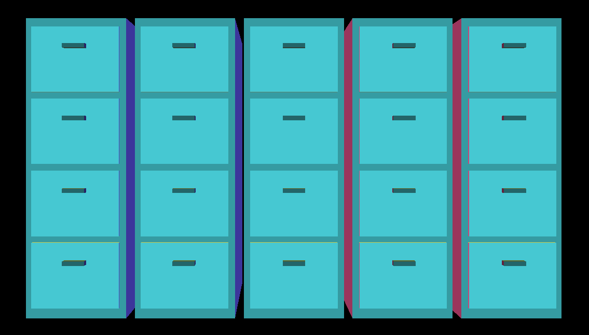
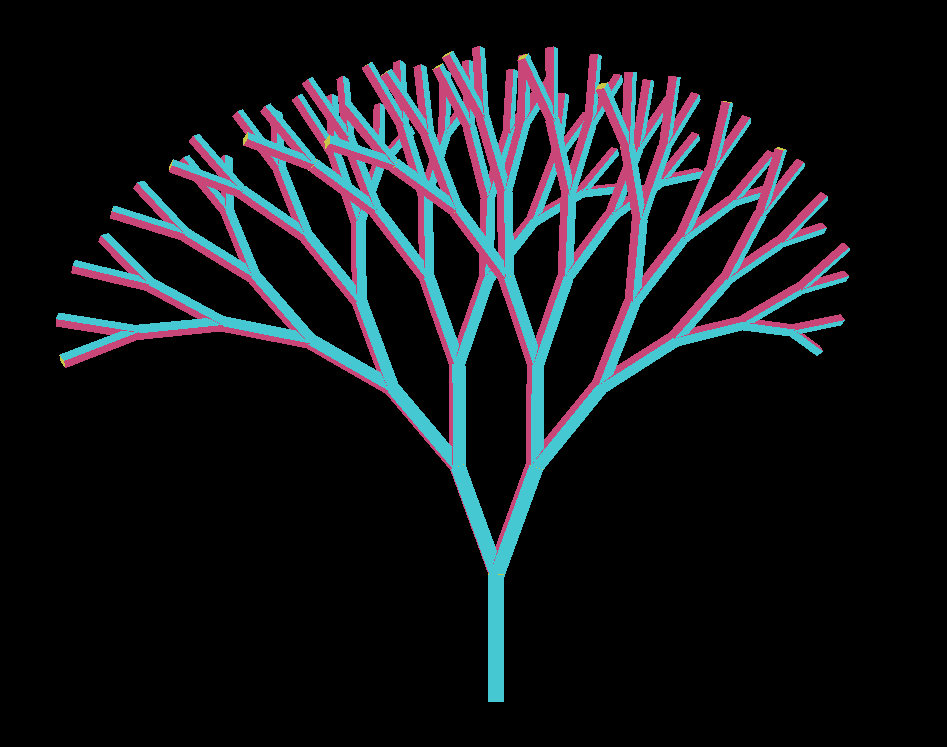
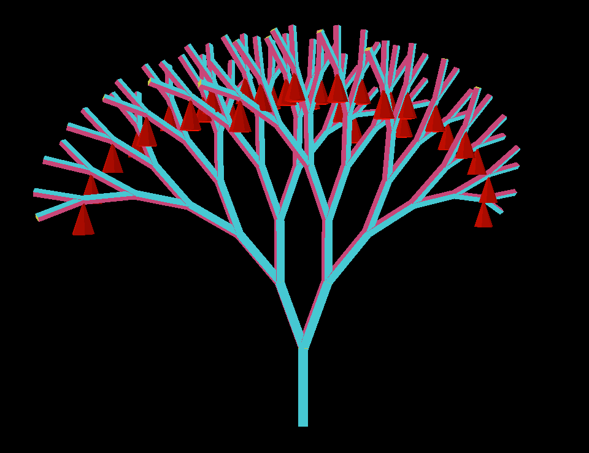

# 行列スタック

https://webgpufundamentals.org/webgpu/lessons/ja/webgpu-matrix-stacks.html

---

行列スタックは「現在の変換」を積む・戻すための入れ物。  
あるものを別のものに対して相対的に配置・方向付けするのに使う。  
ファイルキャビネットや木のように、親の座標系の中に子を、そのまた中に孫を…と入れ子で組み立てたいときに使用する。

メソッド名の `save` / `restore` は Canvas 2D API の [`save`](https://developer.mozilla.org/ja/docs/Web/API/CanvasRenderingContext2D/save) / [`restore`](https://developer.mozilla.org/ja/docs/Web/API/CanvasRenderingContext2D/restore) に合わせたもの（Canvas 2D も内部に描画状態スタックを持つ）。

---

## MatrixStack

現在の行列（`#matrix`）を1つ持ち、`save` で保存し `restore` で戻す。  
変換メソッドは「現在の行列」に対して掛ける。

```ts
export class MatrixStack {
  #matrix: Float32Array = mat4.identity(); // 現在の行列（いま変換を適用している対象）
  #stack: Float32Array[] = [];             // 保存した行列の置き場

  constructor() {
    this.reset();
  }

  reset() {
    this.#matrix = mat4.identity();
    this.#stack = [];
    return this;
  }

  save() {
    this.#stack.push(this.#matrix);         // 現在の行列を積む
    this.#matrix = mat4.copy(this.#matrix); // 複製を新しい「現在の行列」にする
    return this;
  }

  restore() {
    this.#matrix = this.#stack.pop() as Float32Array; // 積んでおいた行列に戻す
    return this;
  }

  get() {
    return this.#matrix;
  }

  set(matrix: Float32Array) {
    return this.#matrix.set(matrix);
  }

  translate(translation: number[]) {
    mat4.translate(this.#matrix, translation, this.#matrix);
    return this;
  }

  rotateX(angle: number) {
    mat4.rotateX(this.#matrix, angle, this.#matrix);
    return this;
  }

  rotateY(angle: number) {
    mat4.rotateY(this.#matrix, angle, this.#matrix);
    return this;
  }

  rotateZ(angle: number) {
    mat4.rotateZ(this.#matrix, angle, this.#matrix);
    return this;
  }

  scale(scale: number[]) {
    mat4.scale(this.#matrix, scale, this.#matrix);
    return this;
  }
}
```

- `save()` は現在の行列を積んでから、その複製を新しい「現在の行列」にする。複製せず参照のまま使い続けると、スタックに積んだ行列まで一緒に書き換わってしまう。
- 各メソッドが `this` を返すので `stack.save().scale(...).translate(...)` とチェーンできる。

---

## drawObject

`drawObject` で1つのオブジェクトを描く。渡す `matrix` はスタックの現在の行列（＝モデル変換）。  
スタックが持つのはモデル変換だけなので、ビュー射影行列は描画時にここで合成する。

```ts
private drawObject(ctx: DrawContext, matrix: Float32Array, color: number[]) {
  const { pass, viewProjectionMatrix } = ctx;

  if (this.objectNdx === this.objectInfos.length) {
    this.objectInfos.push(this.createObjectInfo());
  }
  const { matrixValue, colorValue, uniformBuffer, uniformValues, bindGroup } =
    this.objectInfos[this.objectNdx++];

  mat4.multiply(viewProjectionMatrix, matrix, matrixValue); // PV * M
  colorValue.set(color);                                    // オブジェクトごとの色

  this.device.queue.writeBuffer(uniformBuffer, 0, uniformValues);

  pass.setBindGroup(0, bindGroup);
  pass.draw(this.numVertices);
}
```

---

## save / restore で部品ごとに変換を独立させる



（引き出し）=（本体）＋（取っ手） の2部品を描く。  
本体と取っ手をそれぞれ `save` / `restore` で挟むと、片方の変換が後続に漏れない。

```ts
private static readonly kDrawerSize = [40, 30, 50];
private static readonly kHandleSize = [10, 2, 2];

private static readonly kHandlePosition = [
  (App.kDrawerSize[App.kWidth] - App.kHandleSize[App.kWidth]) / 2,
  (App.kDrawerSize[App.kHeight] * 2) / 3,
  App.kHandleSize[App.kDepth],
];

private drawDrawer(ctx: DrawContext) {
  const { stack } = ctx;

  // 本体
  stack.save();
  stack.scale(App.kDrawerSize);
  this.drawObject(ctx, stack.get(), App.kDrawerColor);
  stack.restore();

  // 取っ手
  stack.save();
  stack.translate(App.kHandlePosition);
  stack.scale(App.kHandleSize);
  this.drawObject(ctx, stack.get(), App.kHandleColor);
  stack.restore();
}
```

本体の `scale(kDrawerSize)` を `restore` で捨ててから取っ手を描く。`restore` せずに続けると、取っ手が本体のスケールごと引き伸ばされてしまう。  

呼び出し側は基準の変換をスタックに積んでから `drawDrawer` を呼ぶ。

```ts
this.stack.save();
this.stack.rotateY(this.settings.baseRotation);
this.stack.translate([App.kDrawerSize[App.kWidth] * -0.5, 0, 0]); // 中心を原点へ
this.drawDrawer(ctx);
this.stack.restore();
```



---

## 描画関数を入れ子に呼ぶ



（キャビネット）= （外箱）＋（引き出し複数段）を描く。  
`drawDrawer` は一切変更せず、各段を `translate` して呼ぶのみ。ループの各回を `save` / `restore` で挟むので、段ごとの平行移動が互いに干渉しない。

```ts
private drawCabinet(ctx: DrawContext, numDrawersPerCabinet: number) {
  const { stack } = ctx;

  const kCabinetSize = [
    App.kDrawerSize[App.kWidth] + 6,
    App.kDrawerSpacing * numDrawersPerCabinet + 6,
    App.kDrawerSize[App.kDepth] + 4,
  ];

  // 外箱
  stack.save();
  stack.scale(kCabinetSize);
  this.drawObject(ctx, stack.get(), App.kCabinetColor);
  stack.restore();

  // 引き出しを縦に並べる
  for (let i = 0; i < numDrawersPerCabinet; ++i) {
    stack.save();
    stack.translate([3, i * App.kDrawerSpacing + 5, 1]);
    this.drawDrawer(ctx); // そのまま再利用
    stack.restore();
  }
}
```

---

## 同じパターンを重ねて階層を深くする



さらに上に階層を追加し、キャビネットを横一列に並べる。`drawCabinet` も `drawDrawer` もそのまま再利用できる。

```ts
private drawCabinets(ctx: DrawContext, numCabinets: number) {
  const { stack } = ctx;
  for (let i = 0; i < numCabinets; ++i) {
    stack.save();
    stack.translate([i * App.kCabinetSpacing, 0, 0]);
    this.drawCabinet(ctx, App.kNumDrawersPerCabinet);
    stack.restore();
  }
}
```

- 階層は cabinets → cabinet → drawer →（本体 / 取っ手）
- どの段も「`save` → 変換 → 子を描画 → `restore`」という同じ型
- 子の関数を書き換えずに親へ埋め込めるのが行列スタックの利点

---

## 再帰で木を作る（tree）



枝1本＝縦長にスケールした単位キューブ。  
枝先へ移動し、少し回して縮小し、そこからまた2本の子枝を再帰で生やす（二分木）。

`drawBranch` はまず `translate([-0.5, 0, 0.5])` で単位キューブ（x:0〜1, z:0〜-1）の x・z の中心を原点へ寄せ、そのあと `scale(kBranchSize)` で寸法まで拡大する。

```ts
private static readonly kBranchSize = [20, 150, 20];
private static readonly kBranchPosition = [-0.5, 0, 0.5];

private drawBranch(ctx: DrawContext) {
  const { stack } = ctx;
  stack.save().scale(App.kBranchSize).translate(App.kBranchPosition);
  this.drawObject(ctx, stack.get(), App.kWhite);
  stack.restore();
}
```

```ts
private drawTreeLevel(ctx: DrawContext, offset: number, treeDepth: number) {
  const { stack } = ctx;
  const s = offset ? this.settings.scale : 1;              // 根はそのまま、子枝は scale < 1 で縮小、scale > 1 で拡大
  const y = offset ? App.kBranchSize[App.kHeight] : 0;     // 子枝は親の先端へ
  stack
    .save()
    .translate([0, y, 0])
    .rotateZ(offset * this.settings.rotationX)             // offset の符号で左右に開く
    .rotateY(Math.abs(offset) * this.settings.rotationY)
    .scale([s, s, s]);

  this.drawBranch(ctx);

  if (treeDepth > 0) {
    this.drawTreeLevel(ctx, -1, treeDepth - 1);            // 左の子枝
    this.drawTreeLevel(ctx, +1, treeDepth - 1);            // 右の子枝
  }

  stack.restore();
}
```

呼び出し側は `baseRotation` だけ積んで、根（`offset = 0`）から再帰を始める。

```ts
this.stack.save();
this.stack.rotateY(this.settings.baseRotation);
this.drawTreeLevel(ctx, 0, App.kTreeDepth); // 根から深さ kTreeDepth で再帰
this.stack.restore();
```

`drawBranch` は `drawTreeLevel` 内で変換を積んだあとに呼ばれるが、行列は右から掛かるので、頂点に作用する順序は逆になる。  
頂点 `v` は `M * v` で右端（最後に掛けた `drawBranch` 側）から順に作用する。

```
M = M_parent
  * T(0, y, 0)          // drawTreeLevel：親の先端へ移動
  * Rz · Ry · S(s)      // drawTreeLevel：向きの調整と縮小
  * S(kBranchSize)      // drawBranch：単位キューブを 20×150×20 に拡大
  * T(kBranchPosition)  // drawBranch：単位キューブの中心を原点へ
```

- `kBranchSize` は `drawBranch` の `save` / `restore` に閉じるので子には伝わらない。一方 `scale([s, s, s])` は `drawBranch` の外にあり `restore` されないので、子・孫へ掛け算で積み重なり、枝は先へ行くほど小さくなる。
- `offset` は根で `0`、子枝で `-1`（左）/ `+1`（右）。`rotateZ(offset * angle)` の符号が左右で反転するので枝が開く。

---

## 位置だけ取り出して飾りをつける



葉先（`treeDepth === 0`）に円錐の飾りを置く。ただしその場のスタック行列をそのまま使うと、飾りまで枝の回転・スケールを受けて傾いたり縮んだりする。  
そこで `vec3.getTranslation` で行列から**平行移動成分だけ**取り出し、`mat4.translation` で「回転なし・等倍」の行列を作って飾りを描く。

```ts
if (treeDepth === 0 && offset > 0) {
  const position = vec3.getTranslation(stack.get()); // 位置だけ抽出（向き・大きさは捨てる）
  this.drawObject(
    ctx,
    this.ornamentVertices,
    mat4.translation([...position]),                 // 直立・等倍で配置
    App.kWhite,
  );
}
```

```ts
// vec3.getTranslation：行列の 12,13,14 要素が平行移動成分
getTranslation(m, dst) {
  dst[0] = m[12];
  dst[1] = m[13];
  dst[2] = m[14];
  return dst;
}
```

葉は親から左（`offset = -1`）と右（`offset = +1`）の2本が出るが、どちらも付け根は親の先端で同じになる。  
両方で飾ると同じ場所に2個重なるので、片方（`offset > 0`）だけに置く。
