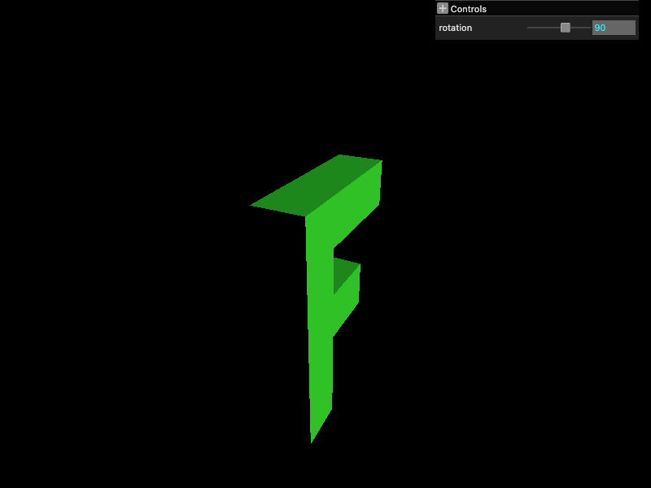
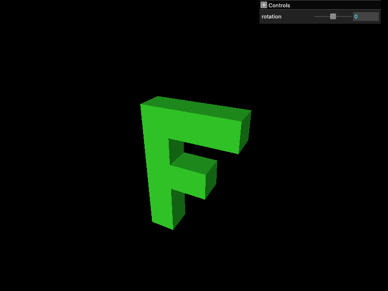
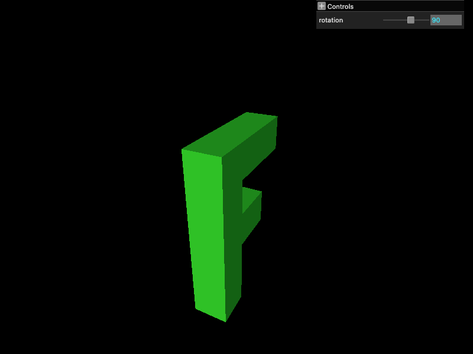
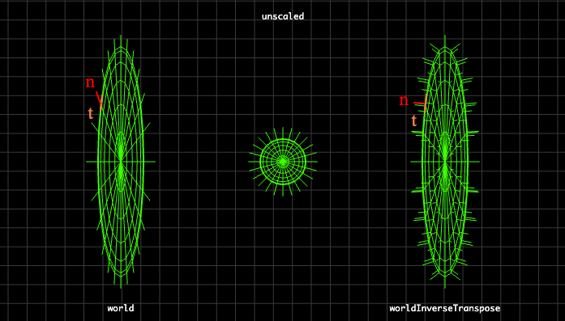

# 指向性ライティング

https://webgpufundamentals.org/webgpu/lessons/ja/webgpu-lighting-directional.html

---

## 指向性ライティング（ディレクショナルライト／平行光源）

- 光が一方向から平行に届くと仮定するモデル。
- 例えば、太陽光は平行光源とみなせる。

---

## 法線とライトベクトル

- 法線は、面が向いている方向を表す単位ベクトル。
- ライトベクトルは、光源へと向かうベクトル。
- 面の明るさは、法線とライトベクトルの内積（= 2つのベクトルのなす角の余弦）で決まる。

| 内積 | 面と光の関係 | 明るさ |
|---|---|---|
| 1 | 正対 | 最大 |
| 0 | 直交 | 0 |
| 負 | 裏向き | 0 以下（暗い） |


```wgsl
// フラグメントシェーダ
let normal = normalize(vsOut.normal);
let light = dot(normal, -uni.lightDirection);
let color = uni.color.rgb * light;
return vec4f(color, uni.color.a);
```

法線が inter-stage 変数として線形補間され、補間後は単位長でなくなるため 正規化（`normalize`）が必要。

---

## 法線とモデル（ワールド）座標変換

### 01. 位置のみ変換を行う場合

```wgsl
// 頂点シェーダ
vsOut.position = uni.matrix * vert.position;    // 位置を MVP 変換
vsOut.normal = vert.normal;                     // 法線は変換を適用しない
```




- 頂点位置をモデル座標変換するだけでは、正しいライティングが得られない。
- 頂点座標を回転させても、法線はそれに自動で追従しない。
- その結果、実際の面の向きと法線がずれ、頂点と一緒に`光の当たり方も回転`してしまう。
- 頂点位置を変換するなら、`法線も同じように変換`する必要がある。


### 02. 法線の変換を行う


```wgsl
vsOut.position = uni.worldViewProjection * vert.position;   // 位置を MVP 変換
vsOut.normal = (uni.world * vec4f(vert.normal, 0)).xyz;     // 法線は M 変換
```

法線は位置ではなく方向なので、行列の平行移動列を作用させたくない。  
`w=0` にすると平行移動成分がゼロ乗算で消える。




### 03. モデル座標変換では破綻する場合がある

- `非一様スケール`（軸ごとに違う倍率）が入ると、法線の変換は破綻する。
- `非一様スケール`の場合、スケール後の法線が面に垂直でなくなり、正しいライティングが得られない。

※ 上の「F」の例の場合は、Y 軸回転のみなので、正しいライティングが得られている。



Y 方向に非一様スケールした場合、接ベクトル $\boldsymbol{t}$ と法線ベクトル $\boldsymbol{n}$ が直交してない（左）。

---

## Normal Matrix

### 01. モデル座標変換行列の逆転置行列

非一様スケールによる破綻を防ぐには、`モデル座標変換行列`そのものではなく`モデル座標変換行列の逆転置行列`で法線を変換する。  
これが `Normal Matrix` に相当する。

```ts
mat3.fromMat4(mat4.transpose(mat4.inverse(world)), this.normalMatrixValue);
```

法線は方向だけを持つので平行移動は不要。  
4x4 のモデル座標変換行列から、回転・スケール部分の 3x3 を取り出して（`mat3.fromMat4`）使用する。

```wgsl
vsOut.position = uni.worldViewProjection * vert.position;   // 位置を MVP 変換
vsOut.normal = uni.normalMatrix * vert.normal;              // 法線は normalMatrix で変換
```

### 02. 導出

法線 $\boldsymbol{n}$ は面上の任意の接ベクトル $\boldsymbol{t}$ と直交する。


```math
\boldsymbol{n}^\top \boldsymbol{t} = 0
```

位置を行列 $\mathbf{M}$ で変換すると接ベクトルは $\mathbf{M}\boldsymbol{t}$ になる。  
変換後の法線 $\boldsymbol{n'}$ は変換後の接ベクトル $\mathbf{M}\boldsymbol{t}$ と直交する必要がある。

```math
\boldsymbol{n'}^\top (\mathbf{M}\boldsymbol{t}) = 0
```

ここで、法線を正しく変換する行列、すなわち `Normal Matrix` を $\mathbf{G}$ と置く。このとき $\boldsymbol{n'} = \mathbf{G}\boldsymbol{n}$ とかける。

```math
(\mathbf{G}\boldsymbol{n})^\top (\mathbf{M}\boldsymbol{t}) = \boldsymbol{n}^\top \mathbf{G}^\top \mathbf{M} \boldsymbol{t} = 0
```

元々 $\boldsymbol{n}^\top \boldsymbol{t} = 0$ であり、上の関係が任意の $\boldsymbol{t}$ で成り立つには $\mathbf{G}^\top \mathbf{M} = \mathbf{I}$。すなわち、

```math
\mathbf{G}^\top = \mathbf{M}^{-1} \quad\Rightarrow\quad \mathbf{G} = (\mathbf{M}^{-1})^\top = (\mathbf{M}^\top)^{-1}
```

従って、位置を $\mathbf{M}$ で変換するとき、法線は $(\mathbf{M}^{-1})^\top$ で変換すれば面との直交性が保たれる。

### 03. 回転や一様スケールのみならモデル座標変換行列を用いてもよい

#### （ i ） 回転

回転行列は直交行列（各列が正規直交）なので $\mathbf{R}\mathbf{R}^\top = \mathbf{I}$ が成り立つ。すなわち $\mathbf{R}^{-1} = \mathbf{R}^\top$。

```math
\mathbf{R} =
\begin{bmatrix}
\cos\theta & -\sin\theta \\
\sin\theta & \cos\theta
\end{bmatrix}
\qquad
\mathbf{R}^\top =
\begin{bmatrix}
\cos\theta & \sin\theta \\
-\sin\theta & \cos\theta
\end{bmatrix}
```

実際に積を取ると単位行列になる。

```math
\mathbf{R}\mathbf{R}^\top =
\begin{bmatrix}
\cos^2\theta + \sin^2\theta & 0 \\
0 & \cos^2\theta + \sin^2\theta
\end{bmatrix}
=
\begin{bmatrix}
1 & 0 \\
0 & 1
\end{bmatrix}
```

回転のみ $\mathbf{M} = \mathbf{R}$ なら、

```math
\mathbf{G} = (\mathbf{M}^{-1})^\top = (\mathbf{R}^\top)^\top = \mathbf{R} = \mathbf{M}
```

つまり `Normal Matrix` はモデル座標変換行列と一致し、モデル座標変換行列で法線を変換しても正しい。


#### （ ii ） 回転 + 一様スケール

一様スケール $s$ が加わって $\mathbf{M} = s\mathbf{R}$ の場合を考える。

```math
\mathbf{M} = s\mathbf{R} =
\begin{bmatrix}
s\cos\theta & -s\sin\theta \\
s\sin\theta & s\cos\theta
\end{bmatrix}
```

$\mathbf{M} = s\mathbf{R}$ は「一様スケール $s\mathbf{I}$」と「回転 $\mathbf{R}$」の積とみなせるので、以下のように展開できる。

```math
\mathbf{M} = s\mathbf{R} = (s\mathbf{I})\,\mathbf{R}
```

$\mathbf{M}$ の逆行列は

```math
\mathbf{M}^{-1} = \mathbf{R}^{-1}(s\mathbf{I})^{-1} = \mathbf{R}^{-1}\cdot\tfrac{1}{s}\mathbf{I} = \tfrac{1}{s}\mathbf{R}^{-1}
```

従って、`Normal Matrix` は以下のようになる。

```math
\mathbf{G} = (\mathbf{M}^{-1})^\top = \tfrac{1}{s}\mathbf{R} =
\begin{bmatrix}
\tfrac{\cos\theta}{s} & -\tfrac{\sin\theta}{s} \\
\tfrac{\sin\theta}{s} & \tfrac{\cos\theta}{s}
\end{bmatrix}
```

ここで $\mathbf{R}^{-1} = \mathbf{R}^\top$ の関係性を用いた。

$\mathbf{G} = \tfrac{1}{s}\mathbf{R}$ は、モデル座標変換行列 $\mathbf{M} = s\mathbf{R}$ とは $\tfrac{1}{s^2}$ 倍の違い（定数倍）だけで、回転成分 $\mathbf{R}$ は共通。  
定数倍は、フラグメントシェーダで `normalize` すれば結果は変わらない。

破綻するのは非一様スケールのときのみで、それ以外はモデル座標変換行列を用いても問題ない。  
しかし、一般性を考えるなら、常に `Normal Matrix`（逆転置）を用いるのが無難。
